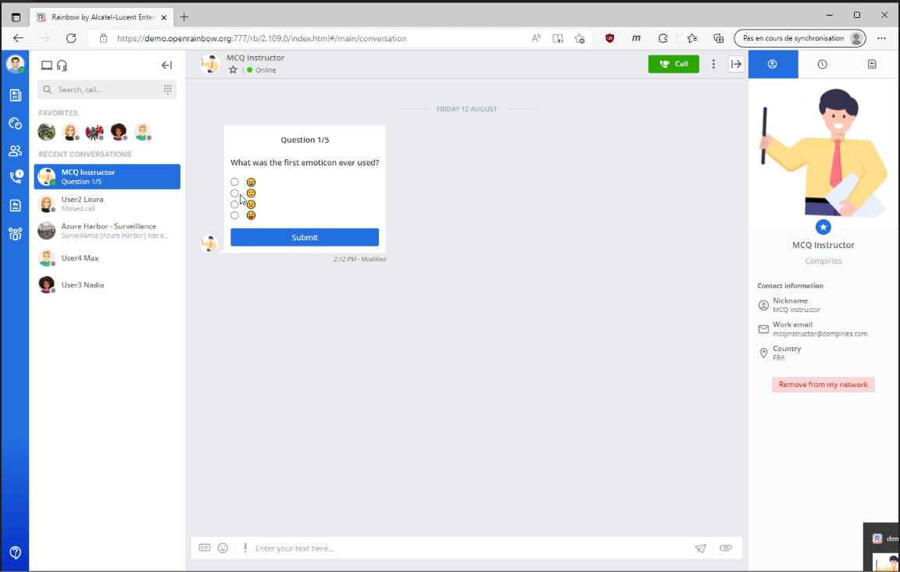

 
# Rainbow CSharp SDK - Bot Adaptive Cards
---

This example has been created using the [**Bot Base**](../BotBase) code. Ensure to understand it before to continue.

This example is working on **Linux, MacOs or Windows**.

It's based on a state machine to simplify the complexity and use **Adaptive Cards** to display MCQ question.

[](./images/Rainbow-MCQTest.mp4)

- [Bot features](#BotFeatures)

- [Dot graph](#DotGraph)

- [Configuration and log file](#Configuration)

- [Adaptive Cards](#AdaptiveCards)

- [Implementation details](#ImplementationDetails)
 
<a name="BotFeatures"></a>
## Bot Features
---

The goal of this Bot is to create a multiple choice question (**MCQ**) test for a specific list of users defined at startup. (see **USER_LIST_FOR_MCQ** variable)

Questions to users are displayed using **Adaptive cards**.

So we need to properly manage the connection with the RB server, contact all the users who need to take the test and, when they are ready, run the test until the end.

To simplify the complexity to create this bot, we have modified slightly the **state machine** created in **Bot Base**.

Firts we removed some states/triggers not necessayr in this sample and add new ones 

**Features**:

- Get dot graph of the [state machine](../README.md#StateMachine) (thanks to [stateless](https://github.com/dotnet-state-machine/stateless) third-party)

- Accept a specific configuration (login, pwd, host, ini file location, user list who must take the test) - so it's possible to create several bot and used them in sametime. If a thousand users need to pass the test, we can imagine having several bots (for example one for 100 users) instead of a single bot...

- Connect to Rainbow server and manage auto-reconnection (at least once an authentication has succeeded)

- Once connected, we send a welcome message to all test participants one by one, explaining that a MCQ test is available and how to start it. 

- Manage incoming messages:

  - Message coming from ourself are not taken into account.
  
  - Message coming from bubble are not taken into account.
  
  - Message coming directly from user who doesn't need to take the test are not taken into account 
  
  - Message coming from users taking the test are analysed and only anser to the test are taken into account: answer aer stored and the next question is displayd until the end. Then a final message is sentd with the test result.

We also need to modify a restriction defined in the **Bot base**. We want users to be able to see MCQ messages even after reconnecting. So messages must therefore be stored.

```cs 
RbApplication.Restrictions.MessageStorageMode = Restrictions.SDKMessageStorageMode.Store; // in Bot Base, we used Restrictions.SDKMessageStorageMode.NoStore
   
```  

You can watch a [Video here](./images/Rainbow-MCQTest.mp4) to see the result.  

<a name="DotGraph"></a>
## Dot graph
---

It's the dot graph of this bot 


The image file has been created using this online tool https://dreampuf.github.io/GraphvizOnline/ using the dot graph generated wiht this line of code:
```cs 
StateMachine<State, Trigger> _machine; // The state machine
...
String dotGrpah = UmlDotGraph.Format(_machine.GetInfo()); // Create dot graph as String once the state machine has been totally defined   
```  

<a name="Configuration"></a>
## Configuration and log file
---

To use this sample you need to define several information in file **RainbowApplicationInfo.cs**:

- **APP_ID, APP_SECRET_KEY**: Id and Secret key of your Rainbow application - more details [here](https://developers.openrainbow.com/doc/hub/developer-journey).

- **HOST_NAME**: the hostname to use to reach Rainbow server - for example **openrainbow.com**.

- **LOGIN_MASTER_BOT**: the login (i.e. email address) of the user (the "master bot") which can stop the bot remotely using a IM message.

- **LOGIN_BOT, PASSWORD_BOT**: Login and password to use for the bot to connect to the server.

- **USER_LIST_FOR_MCQ**: List of login emial users who must take the MCQ tests 

- **NLOG_CONFIG_FILE_PATH**: Valid path to a XML file used to configure NLog. Without it no log files will be generated. This XML file is available [here](https://github.com/Rainbow-CPaaS/Rainbow-CSharp-SDK-Samples/blob/master/NLogConfiguration.xml).

**NOTE**: APP_ID, APP_SECRET_KEY and HOST_NAME are linked. Generally APP_ID and APP_SECRET_KEY are different according the HOST_NAME.

<a name="AdaptiveCards"></a>
## Adaptive Cards
---

To know more about **Adaptive Cards** check first the [dedicated web site](https://adaptivecards.io/)

It's well documented:

- [Designer](https://adaptivecards.io/): Very usefull to create / design your Adaptive card

- [Schema Explorer](https://adaptivecards.io/explorer/)

- [Samples](https://adaptivecards.io/samples/)

To integrate them in this Bot, we used this package [AdaptiveCards.Templating](https://www.nuget.org/packages/AdaptiveCards.Templating).

It permits to create them using [Adaptive Card Templating](https://docs.microsoft.com/en-us/adaptive-cards/templating/): you have one file as a template and another file for the data.

So to create all questions in this MCQ test sample, we use only one template (using the file **mcqQuestion-template.json** as embedded resource) and for each question a file for the data (for example **mcqQuestion-data-01.json** for the first question)

```cs
// Get json template using resource "mcqQuestion-template.json"
String? jsonTemplate = Util.GetContentOfEmbeddedResource("mcqQuestion-template.json", System.Text.Encoding.UTF8);

// Get json data using resource "mcqQuestion-data-01.json"
String? jsonData = Util.GetContentOfEmbeddedResource($"mcqQuestion-data-01.json", System.Text.Encoding.UTF8);

// Create a Template instance from the template payload
AdaptiveCardTemplate template = new AdaptiveCardTemplate(jsonTemplate);

// "Expand" the template - this generates the final Adaptive Card payload
string cardJson = template.Expand(jsonData);
   
```  

To receive an answer on the bot side, it's necessary to use an **[Action.Submit element](https://adaptivecards.io/explorer/Action.Submit.html)** like this:
```json
{
	"type": "Action.Submit",
	"title": "Submit",
	"data": {
		"rainbow": {
			"type": "messageBack",
			"value": {},
			"text": "Question 1/5"
		}
	}
}
```

The **rainbow** object is mandatory. Attributes **type, value and text** are mandatory too.

**type** must always be set to **messageBack**.

**value** must be an object not null. So **{}** is the minimum expected.

**text** must be a string with at least one caracter. This string will be used as response in the conversation stream (in this bot sample, we use **Question 1/5 answered**, **Question 2/5 answered**, etc ...).

When all this is well defined, the bot will receive an **IM message** from the conversation when the **Action.Submit element** is clicked:

- with a **content** equals to value of the **text** attributes

- with an **alternate content** with a type set to **rainbow/json** and with a JSON content with all objects defined in **data** object in the **Action.Submit element** of the **Adaptive Card**.
 

<a name="ImplementationDetails"></a>
## Implementation details
---

This example is composed mainly 3 files: **RainbowApplicationInfo.cs, Program.cs and RainbowBotConnect.cs**

### RainbowApplicationInfo.cs

Used to store main information (see previous chapter)

### Program.cs

Contains the Main method. It checks if main information seems correct, initialize log configuration, create bot and configure it. 

It also check two specific states: **NotConnected** and **Created**

#### NotConnected state 

If we are in this state, we need to take a specific action (or perhaps nothing more) according the **trigger** used to reach this state

- **Disconnect trigger**: The bot has received the "stop message" from the "master bot". It will do nothing more. Needs to add more logic if we want to start it again.    

- **ServerNotReachable trigger**: The server has never been reached. Need to add more logic to try again

- **TooManyAttempts trigger**: The Bot was logged at least once but now even after several attempts it's no more possible. Needs to add more logic to try again.

#### Created state

If we are in this state, we need to take a specific action (or perhaps nothing more) according the **trigger** used to reach this state

- **AllMCQTestPassed trigger**: Bot has finished - all MCQ has been performed - a test can also be set as finished if email provided is not correct/not found.    

- **IncorrectCredentials trigger**: Credentials provided are incorrect. It's necessary to provide new ones. Needs to add more logic to try again.


### RainbowBotConnect.cs

All possible states and triggers of the bot using a state machine are defined in this file.

**Trigger's list:** Configure, StartLogin, Disconnect, ServerNotReachable, IncorrectCredentials, AuthenticationSucceeded, InitializationPerformed, Connect,  TooManyAttempts, MCQToInitialize, MCQInitialized, AllMCQTestPassed, DequeueMessages, MessageReceivedFromPeer, StopMessage, MessageManaged
 
**State's list:** Created, NotConnected, Connecting, ConnectionFailed, Authenticated, Initialized, Connected, InitializeUserMCQ, AutoReconnection, StopMessageReceived, MessageFromPeer


**Main methods are:**

- **ConfigureStateMachine**: To create / configure all the state machine

- **CheckMCQforUsersAndDequeuedMessages**: Check in this order: if MCQ test has not been started for one user, message in the queued.   

- **CreateRainbowObjects**: To create all necessary objects from the Rainbow SDK C#

- **SetRainbowRestrictions**: To specify restrictions to use in the Rainbow SDK - for example we want to use the AutoReconnection service and don' want to store message

- **SubscribeToRainbowEvents / UnsubscribeToRainbowEvents**: To subscribe / unsubscribe to all necessary events from the Rainbow SDK C#

- **SendMCQQuestion**: To send to the specified user the next MCQ question

- **EditMCQQuestion**: To edit (update) previous MCQ question set (to avoid the user to answer to it again)

- **SendMCQResult**: To send to the specified user the result of his MCQ test
 

 
