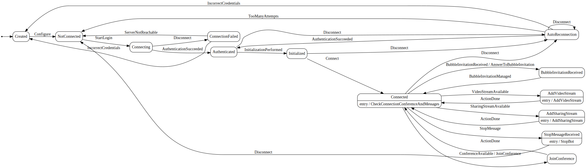

 
# Rainbow CSharp SDK - Bot Video Broadcaster
---

This example has been created using the [**Bot Base**](../BotBase) code. Ensure to understand it before to continue.

This example is working on **Linux, MacOs or Windows**.

It's based on a state machine to simplify the complexity and use [**Rainbow.CSharp.SDK.WebRTC**](https://www.nuget.org/packages/Rainbow.CSharp.SDK.WebRTC/) package to stream Video in a Conference.

This package add **WebRTC features** in the Rainbow SDK CSharp. It necessary to understand how to use it first using [**samples available here**](C:\Mercurial\CSharpSDKSamples\WebRTC)

This sample is also the first one using two bots in sametime. You can easily change it to add more bots.  


- [Bot features](#BotFeatures)

- [Dot graph](#DotGraph)

- [Configuration and log file](#Configuration)

- [Implementation details](#ImplementationDetails)
 
<a name="BotFeatures"></a>
## Bot Features
---

**Script:**

 - Allow a security guard to **easily monitor all available CCTV** in a specific area.
 
 - For each sector, a bubble was created with one or more security guards and **one or more "Bot Video BroadCaster"**.

 - **When a guard starts the conference, all "Bot Video BroadCaster" members join it** to broadcast their CTTV. It is therefore possible to check if everything is fine in this area.

In the video shared as example, two "Bot Video BroadCaster" are running and ready to join the conference. The first bot has been configrued to stream two videos, the second one to stream only one.

We can see also at the end that one of the bot has been stopped thanks to a specific message send by the **master bot**

Each bot need to properly manage the connection with the RB server, join the conference when avaialble and start the video brodcast.

To simplify the complexity to create this bot, we have modified slightly the **state machine** created in **Bot Base**.

**Features**:

 - Bot is configured with
    - A video stream URI - for example a CCTV - can be null
    - A sharing stream URI - for example another CCTV - can be null
    - A bubbleId - can be null
    - Credentials to connect to Rainbow Server
 - If a bubbleId has been set, it will join ONLY a conference from this bubble automatically when available. 
 - If a bubbleId has NOT been set, it will join automatically any conference when available.
 - When it has joined a conference, it will start the streaming of video and/or sharing defined.
 - If a sharing is already used, it will wait until it ends to play its own sharing stream.
 - If CCTV stream is not avaialble (or no more available), the bot will try automatically a new connection.
 - "Master Bot" can ask him to stop using specific "stop message"
 
<a name="DotGraph"></a>
## Dot graph
---

It's the dot graph of this bot 



The image file has been created using this online tool https://dreampuf.github.io/GraphvizOnline/ using the dot graph generated wiht this line of code:
```cs 
StateMachine<State, Trigger> _machine; // The state machine
...
String dotGrpah = UmlDotGraph.Format(_machine.GetInfo()); // Create dot graph as String once the state machine has been totally defined   
```  

<a name="Configuration"></a>
## Configuration and log file
---

To use this sample you need to define several information in file **RainbowApplicationInfo.cs**:

- **APP_ID, FFMPEG_LIB_FOLDER_PATH**: Absolute or relative path to ffmpeg library - more details [here](https://www.nuget.org/packages/Rainbow.CSharp.SDK.WebRTC/).

- **APP_ID, APP_SECRET_KEY**: Id and Secret key of your Rainbow application - more details [here](https://developers.openrainbow.com/doc/hub/developer-journey).

- **HOST_NAME**: the hostname to use to reach Rainbow server - for example **openrainbow.com**.

- **LOGIN_MASTER_BOT**: the login (i.e. email address) of the user (the "master bot") which can stop the bot remotely using a IM message.

- **STOP_MESSAGE_BOT_01**: "Stop message" uses to stop the first bot

- **NAME_BOT_01**: Name of the first bot

- **LOGIN_BOT_01, PASSWORD_BOT_01**: Login and password to use for the first bot to connect to the server.

- **STOP_MESSAGE_BOT_02**: "Stop message" uses to stop the second bot

- **NAME_BOT_02**: Name of the second bot

- **LOGIN_BOT_02, PASSWORD_BOT_02**: Login and password to use for the second bot to connect to the server.

- **VIDEO_URI_01, VIDEO_URI_02, VIDEO_URI_03**: Uri to a CCTV or video file (local or remote)

- **NLOG_CONFIG_FILE_PATH**: Valid path to a XML file used to configure NLog. Without it no log files will be generated. This XML file is available [here](https://github.com/Rainbow-CPaaS/Rainbow-CSharp-SDK-Samples/blob/master/NLogConfiguration.xml).

**NOTE**: APP_ID, APP_SECRET_KEY and HOST_NAME are linked. Generally APP_ID and APP_SECRET_KEY are different according the HOST_NAME.

<a name="ImplementationDetails"></a>
## Implementation details
---

This example is composed mainly 3 files: **RainbowApplicationInfo.cs, Program.cs and RainbowBotConnect.cs**

### RainbowApplicationInfo.cs

Used to store main information (see previous chapter)

### Program.cs

Contains the Main method. It checks if main information seems correct, initialize log configuration, create the two bots and configure them. You can add easily more bots if necesary.

It also check two specific states for each bot: **NotConnected** and **Created**

#### NotConnected state 

If we are in this state, we need to take a specific action (or perhaps nothing more) according the **trigger** used to reach this state

- **Disconnect trigger**: The bot has received the "stop message" from the "master bot". It will do nothing more. Needs to add more logic if we want to start it again.    

- **ServerNotReachable trigger**: The server has never been reached. Need to add more logic to try again

- **TooManyAttempts trigger**: The Bot was logged at least once but now even after several attempts it's no more possible. Needs to add more logic to try again.

#### Created state

If we are in this state, we need to take a specific action (or perhaps nothing more) according the **trigger** used to reach this state

- **IncorrectCredentials trigger**: Credentials provided are incorrect. It's necessary to provide new ones. Needs to add more logic to try again.


### BotVideoBroadcaster.cs

All possible states and triggers of the bot using a state machine are defined in this file.

**Trigger's list:** Configure, StartLogin, Disconnect, ServerNotReachable, IncorrectCredentials, AuthenticationSucceeded, InitializationPerformed, Connect, TooManyAttempts, VideoStreamAvailable, SharingStreamAvailable, ConferenceAvailable, ActionDone, BubbleInvitationReceived, BubbleInvitationManaged,StopMessage
 
**State's list:** Created, NotConnected, Connecting, ConnectionFailed, Authenticated, Initialized, Connected, JoinConference, AddVideoStream, AddSharingStream, AutoReconnection, BubbleInvitationReceived, StopMessageReceived


**Main methods are:**

- **ConfigureStateMachine**: To create / configure all the state machine.

- **CheckConnectionConferenceAndMessages**: Check in this order: connection to the server, bubble invitations, conference in progress, media to add in conference, messages queued.   

- **CreateRainbowObjects**: To create all necessary objects from the Rainbow SDK C#.

- **SetRainbowRestrictions**: To specify restrictions to use in the Rainbow SDK - for example we want to use the AutoReconnection service and don' want to store message.

- **SubscribeToRainbowEvents / UnsubscribeToRainbowEvents**: To subscribe / unsubscribe to all necessary events from the Rainbow SDK C#.

- **JoinConference**: To join a conference.

- **AddVideoStream**: To add video stream in the conference.

- **AddSharingStream**: To add video stream in the conference.

- **CheckIfVideoAndSharingMustBeAdded**: To check if a video and/or sharing stream must be be added in the conference.

- **IsSharingNotUsedByPeer**: To know if a sharing is already used by a peer in the conference.

 

 
