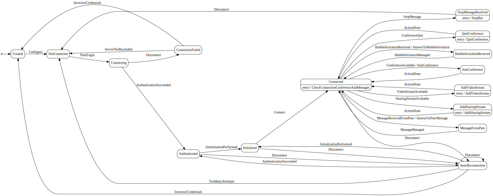

 
# Rainbow CSharp SDK - Bot Video Compositor
---

This example has been created using the [**Bot Base**](../BotBase) code. Ensure to understand it before to continue.

This example is working on **Linux, MacOs or Windows**.

It's based on a state machine to simplify the complexity and use [**Rainbow.CSharp.SDK.WebRTC**](https://www.nuget.org/packages/Rainbow.CSharp.SDK.WebRTC/) package to stream Video in a Conference.

This package add **WebRTC features** in the Rainbow SDK CSharp. It necessary to understand how to use it first using [**samples available here**](C:\Mercurial\CSharpSDKSamples\WebRTC)

This sample is also the first one using **MediaFiltered** object to create a video stream from one or several videos streams  


A video with a better definition is available [here](./images/BotVideoCompositor.mp4)

- [Bot features](#BotFeatures)

- [Dot graph](#DotGraph)

- [Configuration and log file](#Configuration)

- [Implementation details](#ImplementationDetails)
 
<a name="BotFeatures"></a>
## Bot Features
---

**Script:**

 - Allow a security guard to **easily monitor available CCTV** in a specific sector.
 
 - For each sector, a bubble was created with one **Bot Video Compositor**

 - **When a security guard starts the conference, the "Bot Video Compositor" join it automatically** to broadcast one or more CTTV. It is therefore possible to check if everything is fine in this area.

 - The security guard, using an Adpative Card, can choose one or several CCTV and how they are displayd (Size, Fps, Layout: One stream only, Overlay (2 streams), Mosaic (2 or more streams)) 

To simplify the complexity to create this bot, we have modified slightly the **state machine** created in **Bot Base**.

**Features**:

 - Bot is configured with
    - A bubbleId - can be null
    - Credentials to connect to Rainbow Server
 - If a bubbleId has been set, it will join ONLY a conference from this bubble automatically when available. 
 - If a bubbleId has NOT been set, it will join automatically any conference when available.
 - "Master Bot" (i.e. the sqcurity guard) can ask him to stop using specific "stop message"
 
<a name="DotGraph"></a>
## Dot graph
---

It's the dot graph of this bot 



The image file has been created using this online tool https://dreampuf.github.io/GraphvizOnline/ using the dot graph generated wiht this line of code:
```cs 
StateMachine<State, Trigger> _machine; // The state machine
...
String dotGrpah = UmlDotGraph.Format(_machine.GetInfo()); // Create dot graph as String once the state machine has been totally defined   
```  

<a name="Configuration"></a>
## Configuration and log file
---

To use this sample you need to define several information in file **config.json** (JSON format) stored in "Resources" folder.

**Note:** Ensure to validate JSON files before to start the example - for example you can use this online tool: [JsonLint](https://jsonlint.com) 

### config.json

- **ffmpegLibFolderPath**: Absolute or relative path to ffmpeg library - more details [here](https://www.nuget.org/packages/Rainbow.CSharp.SDK.WebRTC/).

- **videosUri**: List of video uri to used as stream (local or remote) 

- **labels**: Absolute or relative path to label file - by default "labels_EN.json"

- **outputRatio**, **outputWidth**, **outputMaxHeight**: For output video stream, define ratios supported then possible width and finally the max height supported

- **vignetteRatio**, **vignetteWidth**, **vignetteMaxHeight**: For vignettes (in Mosaic or in Overlay), define ratios supported then possible width and finally the max height supported

- **fps**: Fps possible values

- **serverConfig**: to configure **appId, appSecret** and **hostname** - more details [here](https://developers.openrainbow.com/doc/hub/developer-journey).

- **command**: to configure **start** (display the Adaptive Card) and **stop** command (to stop the Bot)

- **botManagers**: List of managers of the bot (i.e. security guards). You must specify a **login** (i.e. the email address) **id** and **jid** are optionals

<a name="ImplementationDetails"></a>
## Implementation details
---

This example is composed mainly 3 files: **Program.cs and RainbowBotVideoCompositor.cs**

### Program.cs

Contains the Main method. It checks if configuration file seems correct, initialize log configuration, create the bot and configure it.

It also check two specific states of the bot: **NotConnected** and **Created**

#### NotConnected state 

If we are in this state, we need to take a specific action (or perhaps nothing more) according the **trigger** used to reach this state

- **Disconnect trigger**: The bot has received the "stop message" from the "master bot". It will do nothing more. Needs to add more logic if we want to start it again.    

- **ServerNotReachable trigger**: The server has never been reached. Need to add more logic to try again

- **TooManyAttempts trigger**: The Bot was logged at least once but now even after several attempts it's no more possible. Needs to add more logic to try again.

#### Created state

If we are in this state, we need to take a specific action (or perhaps nothing more) according the **trigger** used to reach this state

- **IncorrectCredentials trigger**: Credentials provided are incorrect. It's necessary to provide new ones. Needs to add more logic to try again.


### RainbowBotVideoCompositor.cs

All possible states and triggers of the bot using a state machine are defined in this file.

**Trigger's list:** Configure, StartLogin, Disconnect, ServerNotReachable, IncorrectCredentials, AuthenticationSucceeded, InitializationPerformed, Connect, TooManyAttempts, BubbleInvitationReceived, BubbleInvitationManaged, ConferenceAvailable, ConferenceQuit, ActionDone, StopMessage, MessageReceivedFromPeer, MessageManaged, VideoStreamAvailable, SharingStreamAvailable
 
**State's list:** Created, NotConnected, Connecting, ConnectionFailed, Authenticated, Initialized, Connected, AutoReconnection, BubbleInvitationReceived, JoinConference, QuitConference, MessageFromPeer, StopMessageReceived, AddVideoStream, AddSharingStream


**Main methods are:**

- **ConfigureStateMachine**: To create / configure all the state machine.

- **CheckConnectionConferenceAndMessages**: Check in this order: connection to the server, bubble invitations, conference in progress, media to add in conference, messages queued.   

- **CreateRainbowObjects**: To create all necessary objects from the Rainbow SDK C#.

- **SetRainbowRestrictions**: To specify restrictions to use in the Rainbow SDK - for example we want to use the AutoReconnection service and don't want to store message.

- **SubscribeToRainbowEvents / UnsubscribeToRainbowEvents**: To subscribe / unsubscribe to all necessary events from the Rainbow SDK C#.

- **JoinConference**: To join a conference.

- **AddVideoStream**: To add video stream in the conference.

- **AddSharingStream**: To add video stream in the conference.

- **CheckIfVideoAndSharingMustBeAdded**: To check if a video and/or sharing stream must be be added in the conference.

- **IsSharingNotUsedByPeer**: To know if a sharing is already used by a peer in the conference.

- **AnswerToPeerMessage**: To answer to a message from a Bot Manager (using a command (start / stop) are when the Adaptive Card is used

- **CreateAndSendAdaptiveCard**: To create the content of Adaptive Card and send it to the Bot Manager 

 
