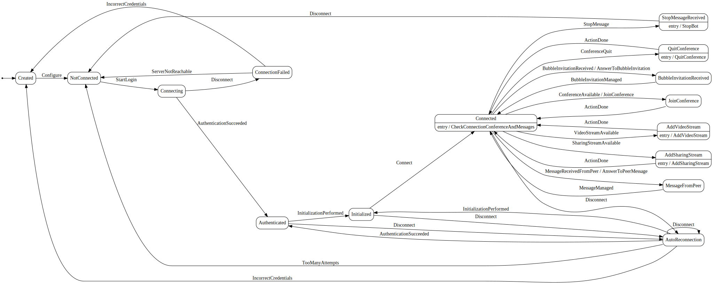

 
# Rainbow CSharp SDK - Bot Video Orchestrator using several Bot Video Broadcaster
---

A video (better quality) can be downloaded [here](./images/BotVideoOrchestratorAndVideoBroadcaster.mp4)

- [Prerequisites](#Prerequisites)

- [Features](#Features)

- [How it works](#HowItWorks)

- [Dot graph](#DotGraph)

- [Configuration and log file](#Configuration)

## Prerequisites
---

This example is working on **Linux, MacOs or Windows**.

It has been created using the [**Bot Video Broadcaster**](../BotVideoBroadcaster) code. Ensure to understand it before to continue.

It's based on a state machine to simplify the complexity and use [**Rainbow.CSharp.SDK.WebRTC**](https://www.nuget.org/packages/Rainbow.CSharp.SDK.WebRTC/) package to stream Video in a Conference.

This package add **WebRTC features** in the [**Rainbow CSharp SDK**](https://developers.openrainbow.com/csharp). It necessary to understand how to use it first using [**samples available here**](C:\Mercurial\CSharpSDKSamples\WebRTC)

## Features
---

 - Using a form from an "Adaptive Card" send by the "Bot Video Orchestrator", it's possible to select zero, one or several "Bot Video Broadcaster".
 
 - For each of them, a stream can be selected: it can be a remote stream (for example from a CCTV) or a local stream (for example a video presentation).
 
 - It's also possible for one of the "Bot Video Broadcaster" to select a stream used as "Sharing" stream in the conference.

 - Once the form is applied, selected "Bot Video Orchestrator" will join the conference and broadcast their stream.
 
 - The form can be used several times so "Bot Video Orchestrator" can join or quit the conference according how the form is filled.
 
 - The list of the "Bot Video Orchestrator" available is defined in a configuration file.
 
 - The list of video stream available is also defined in this file. 
 
 - A notion of "Bot Manager" permits to restrict the use of the form from the "Adaptive Card".
 
 - To display the "Adaptive Card" a specific message (which can be set in the configuration file) must be send by a "Bot Manager".
 
 - Another specific message (configurable) can be used to totally stop each "Bot Video Broadcaster" and the "Bot Video Orchestrator".
 
 - All labels in the form can be changed using a specific file - so you can use your favorite language.

## How it works
---

When the sample is started, configuration file is read to have:
 - Information to connect to Rainbow Server
 - List of "Bot Manager"
 - Details about "Bot Video Orchestrator"
 - List of "Bot Video Broadcaster" 
 - List of video stream
 - File to use for labels
 - Store command used to display Adaptive Card (we call it "commandMenu")
 - Store command used to stop the sample (we call it "commandStop") 

If all this information are correctly set, the "Bot Video Orchestrator" start its login process to Rainbow Server.

Once done, one by one "Bot Video Broadcaster" start their login process to Rainbow Server.

When a conference is started with "Bot Video Orchestrator" as member, the conference Id is stored by the "Bot Video Orchestrator".

Then sending the "commandMenu" to the "Bot Video Orchestrator" will display the form from the Adaptive Card.

Using it will permit to the "Bot Video Orchestrator" to send a message to each "Bot Video Broadcaster" so they can join / quit the conference (using the conference Id stored) and broadcas their video stream.

If there is no conference available for the "Bot Video Orchestrator" when the "commandMenu" is send, it will answer with a message like this: "There is no conference in progress ... No video broadcast settings available." 

When the "commandStop" is used, the "Bot Video Orchestrator" send a message to each "Bot Video Broadcaster" so they can quit properly the current conference (if any) and log out from the Rainbow Server. After a delay, the "Bot Video Orchestrator" also log out form teh Rainbow Server then the process is stopped. 
 

## Dot graph
---

## "Bot Video Orchestrator"

## "Bot Video Broadcaster"

## Configuration and log file
---

Two files, in JSON format, are used, both stored in "Resources" folder:
 - **config.json**
 - **labels_EN.json** (name can changed in "config.json" file)

Ensure to validate JSON files before to start the example - for example you can use this online tool: [JsonLint](https://jsonlint.com) 

### config.json

- **ffmpegLibFolderPath**: Absolute or relative path to ffmpeg library - more details [here](https://www.nuget.org/packages/Rainbow.CSharp.SDK.WebRTC/).

- **serverConfig**: to cofigure **appId, appSecret** and **hostname** - more details [here](https://developers.openrainbow.com/doc/hub/developer-journey).

- **labelsFilePath**: Absolute or relative path to label file - by default "labels_EN.json"

- **videosUri**: List of video uri to used as stream (local or remote)

- **botManagers**: List of manage of the bot. You must specify a **login** (i.e. the email address) **id** and **jid** are optionals

- **botVideoOrchestrator**: Define here the **login**, **password**, **commandMenu**, **commandStop** and **autoJoinConference** (if set to True the Orchestrator will also join the conference)   

- **botsVideoBroadcaster**: Define here list of Broadcaster with their **login** and **password**

- **nbMaxVideoBroadcaster**: To restrict the number of Broadcaster: -1 to use all of them, X to use only the first X Broadcasters defined

### labels_EN.json

To define labels used in the form from the Adaptive Card.

Only two labels needs some description:

- **labelVideosUriName**: To name video stream using the same order than uris specified in **videosUri** of the **config.json** file
  
- **labelBotsVideoBroadcasterName**: To name "Bot Video Broadcaster" using the same order than ones defined specified in **botsVideoBroadcaster** of the **config.json** file
