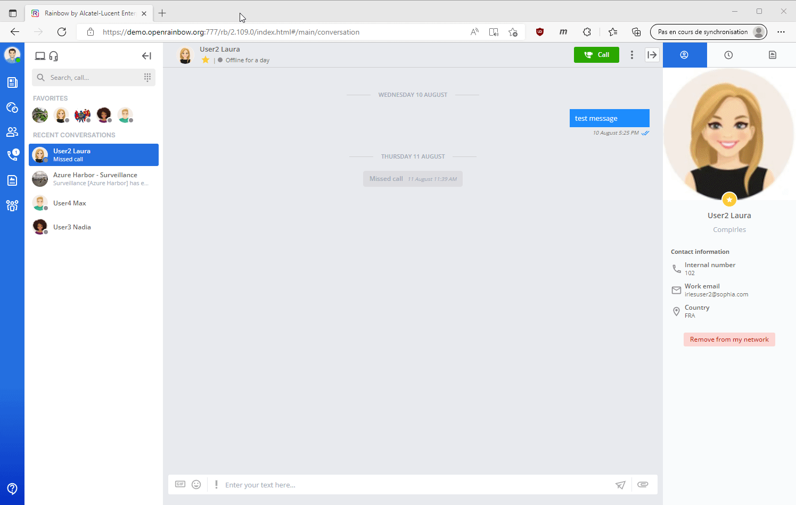

 
# Rainbow CSharp SDK - Bot examples
---

You will find here several samples which illustrate how to use the Rainbow CSharp SDK to create Bot.

They are all working in **Linux, MacOs or Windows**. 

They are listed in order of priority / difficulty if you just started to use the SDK and/or create Bot.

All bots are using a [state machine](#StateMachine) to simplify the complexity.

List of examples:

- [Bot - Base](#BotBase): **This example is the base of all others Bot**.

- [Bot - Adaptive Cards](#BotAdaptiveCards): This example demonstrates how to use [**Adaptive Cards**](https://adaptivecards.io/) for example to create a multiple choice question (MCQ) test.

- [Bot - Video Broadcaster](#BotVideoBroadcaster): This example demonstrates how to automaticaly broadcast video stream in a conference.

- [Bot - Video Orchestrator and Video Broadcaster](#BotVideoOrchestratorAndVideoBroadcaster): Using an Adaptive Card from Bot Video Orhcestrator, select one or several Bot Video Broadcaster to stream video in a conference

<a name="StateMachine"></a>
## State Machine
---

A third party library ([stateless](https://github.com/dotnet-state-machine/stateless) is used to create the state machine.

Several library exists. This one has been choosed because it's a **lightweight one** (no dependency) and **permits to visualize the state machine** using a dot graph like the one below.

The dot grpah can be direclty created from the state machine defined by code using only one line:

```cs 
StateMachine<State, Trigger> _machine; // The state machine
...
String dotGrpah = UmlDotGraph.Format(_machine.GetInfo()); // Create dot graph as String once the state machine has been totally defined   
```

This image represents the state machine of the [Bot - Base](#BotBase):


A dot graph is a plain text describing a graph. To visualize it a tool is necessary like these ones:

- [viz-js](http://viz-js.com/): online visualizer

- [GraphvizOnline](https://dreampuf.github.io/GraphvizOnline/): online visualizer

- [graphviz.org](http://www.graphviz.org/)

<a name="BotBase"></a>
## Bot - Base
---

[This bot](./BotBase/README.md) is used as base for all other bots.

It includes these features:

- Get dot graph of the [state machine](#StateMachine) (thanks to [stateless](https://github.com/dotnet-state-machine/stateless) third-party)

- Create a bot using a specific configuration (login, pwd, host, ini file location) - so it's possible to create several bot and used them in sametime.

- Connect to Rainbow server and manage auto-reconnection (at least once an authentication has succeeded) 

- Manage incoming invitations to share presence with another Rainbow user. They are all automatically accepted.

- Manage incoming invitations to be a member on a bubble. They are all automatically accepted.

- Manage incoming messages:

  - Message coming from ourself are not taken into account.
  
  - To avoid a big flod only X messages by second are read (value easily updatable). The state machine will read the next one when the delay is correct. In the meantime all messages are queued (so there is no loss).
  
  - A different process is used if the message is coming from a bubble or from a one to one conversation. The message is then answered by a default message which depends of the process.


<a name="BotAdaptiveCards"></a>
## Bot - Adaptive Cards
---

[This bot](./BotAdaptiveCards/README.md) is based on **Bot Base**.

The goal of this Bot is to create a multiple choice question (**MCQ**) test for a specific list of users defined at startup.

Questions to users are displayed using **Adaptive cards**.

So we need to properly manage the connection with the RB server, contact all the users who need to take the test and, when they are ready, run the test until the end.



**Features**:

- Get dot graph of the [state machine](../README.md#StateMachine) (thanks to [stateless](https://github.com/dotnet-state-machine/stateless) third-party)

- Accept a specific configuration (login, pwd, host, ini file location, user list who must take the test) - so it's possible to create several bot and used them in sametime. If a thousand users need to pass the test, we can imagine having several bots (for example one for 100 users) instead of a single bot...

- Connect to Rainbow server and manage auto-reconnection (at least once an authentication has succeeded)

- Once connected, we send a welcome message to all test participants one by one, explaining that a MCQ test is available and how to start it. 

- Manage incoming messages:

  - Message coming from ourself are not taken into account.
  
  - Message coming from bubble are not taken into account.
  
  - Message coming directly from user who doesn't need to take the test are not taken into account 
  
  - Message coming from users taking the test are analysed and only anser to the test are taken into account: answer aer stored and the next question is displayd until the end. Then a final message is sentd with the test result.


<a name="BotVideoBroadcaster"></a>
## Bot - Video Broadcaster
---

[This bot](./BotVideoBroadcaster/README.md) is based on **Bot Base**.

**Script:**

 - Allow a security guard to **easily monitor all available CCTV** in a specific area.
 
 - For each sector, a bubble was created with one or more security guards and **one or more "Bot Video BroadCaster"**.

 - **When a guard starts the conference, all "Bot Video BroadCaster" members join it** to broadcast their CTTV. It is therefore possible to check if everything is fine in this area.

In the video shared as example, two "Bot Video BroadCaster" are running and ready to join the conference. The first bot has been configrued to stream two videos, the second one to stream only one.

We can see also at the end that one of the bot has been stopped thanks to a specific message send by the **master bot**


Each bot need to properly manage the connection with the RB server, join the conference when avaialble and start the video brodcast.

To simplify the complexity to create this bot, we have modified slightly the **state machine** created in **Bot Base**.

**Features**:

 - Bot is configured with
    - A video stream URI - for example a CCTV - can be null
    - A sharing stream URI - for example another CCTV - can be null
    - A bubbleId - can be null
    - Credentials to connect to Rainbow Server
 - If a bubbleId has been set, it will join ONLY a conference from this bubble automatically when available. 
 - If a bubbleId has NOT been set, it will join automatically any conference when available.
 - When it has joined a conference, it will start the streaming of video and/or sharing defined.
 - If a sharing is already used, it will wait until it ends to play its own sharing stream.
 - If CCTV stream is not avaialble (or no more available), the bot will try automatically a new connection.
 - "Master Bot" can ask him to stop using specific "stop message"
 
 <a name="BotVideoOrchestratorAndVideoBroadcaster"></a>
 ## Bot - Video Orchestrator and Video Broadcaster
 ---
 
[This bot](./BotVideoOrchestratorAndBroadcaster/README.md) is based on **Bot Video Broadcaster** and also use Adaptive Card.


 - Using a form from an "Adaptive Card" send by the "Bot Video Orchestrator", it's possible to select zero, one or several "Bot Video Broadcaster".
 
 - For each of them, a stream can be selected: it can be a remote stream (for example from a CCTV) or a local stream (for example a video presentation).
 
 - It's also possible for one of the "Bot Video Broadcaster" to select a stream used as "Sharing" stream in the conference.

 - Once the form is applied, selected "Bot Video Orchestrator" will join the conference and broadcast their stream.
 
 - The form can be used several times so "Bot Video Orchestrator" can join or quit the conference according how the form is filled.
 
 - The list of the "Bot Video Orchestrator" available is defined in a configuration file.
 
 - The list of video stream available is also defined in this file. 
 
 - A notion of "Bot Manager" permits to restrict the use of the form from the "Adaptive Card".
 
 - To display the "Adaptive Card" a specific message (which can be set in the configuration file) must be send by a "Bot Manager".
 
 - Another specific message (configurable) can be used to totally stop each "Bot Video Broadcaster" and the "Bot Video Orchestrator".
 
 - All labels in the form can be changed using a specific file - so you can use your favorite language.
 
 
