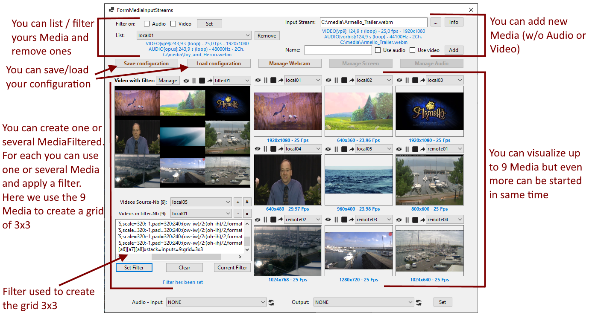

# Rainbow-CSharp-SDK-Samples - Medias 

This folder contains samples which demonstrates how to use the **Rainbow CSharp SDK Medias** 

This SDK targets these platforms: **Windows, MacOs, and Linux**. 

**Only x64 platform is supported.**

**Android and iOS are not yet supported.**

This SDK can be used **without** **Rainbow CSharp SDK (core)** library and don't need a Rainbow Account or use Rainbow servers / infrastructure.

Full Documentation of **Rainbow CSharp SDK Medias** is available **[here](https://developers.openrainbow.com/doc/sdk/csharp/medias/sts/guides/001_getting_started?isBeta=true)**

# Nuget package

The SDK is provided as a Nuget package available [here](https://www.nuget.org/packages/Rainbow.CSharp.Medias/)

**Mostly all dependencies are managed by Nuget package system but, according our platform, it's necessary to install specifc libraries/binaries.** See the dedicated chapter for more details.

This package targets **.Net Standard 2.0**, **.Net Standard 2.1**, **.Net Core App 3.1** and **.Net 5.0**

# Features

It permits to manage Audio and Video streams using:

- Local / Remote Files

- IP TV, Live Stream Server

- Devices like Webcam, Screen/Monitor, Microphone, Speaker, Headset, ...

To access remote streams all this [protocols](https://ffmpeg.org/ffmpeg-all.html#toc-Protocols) are supported.

An Audio and/or Video Stream (whatever its source) is calles a **Media** in this SDK.

A **Media** can be composed of one Audio stream and/or one Video stream.

Using a **Media** it's then possible, for example, to create a Media Player: **Start, Stop, Pause, Resume, Seek actions are possible**.

Using one **Media** or severals, it's then possible to create a **MediaFiltered** using a Video filter and/or an Audio filter.

Video Filter allows to:

- scale, crop, pad, resize, change fps, add subtitles

- create mosaic, overlay, dynamic mask

Audio filter is not yet supported. The **MediaFiltered** will use the Audio stream of the specified **Media**.

On the fly you can change the filter. The Audio/Video stream of the **MediaFiltered** will be updated in consequence without the need to re-start all **Media** used. 

# Filter - List, Syntax and Examples

## Filter - List

The list of available **Audio filters** are available [here](https://ffmpeg.org/ffmpeg-all.html#Audio-Filters)

The list of available **Video filters** are available [here](https://ffmpeg.org/ffmpeg-all.html#Video-Filters)

## Filter - Syntax

Same syntax used in FFmpeg can be used in this package.

The best thing to do it's to test first your filter using ffmpeg with a command line using **"-vf"** parameter (to set video filter). The same value can be used as filter in this SDK.  

## Filter - Examples

Here some examples than can be used.

### Using only one **Media**

To have video in gray:
```
format=gray
```

To blur the video:
```
avgblur=10
```

To scale the video:
```
scale=400:-2
```

To crop the video:
```
crop=400:400
```

To draw a text on the video:
```
drawtext=text=%{localtime\: %X }:fontcolor=white:fontsize=40:y=(main_h-text_h)/2:x=(main_w-text_w)/2
```

To add subtitles on the video using subtitles from the file "c:\media\TOEFLTest.mp4"
```
subtitles=f=c\\:\\\\medias\\\\TOEFLTest.mp4:si=0
```

**Several options can set in same time**, for example, to scale then pad the video: 
```
scale=200:-2,pad=320:200:(ow-iw)/2:(oh-ih)/2
```

Here, we blur a zone of a video and add also subtitles: 
```
[0:v]crop=400:400,avgblur=10[fg];[0:v][fg]overlay=(main_w-overlay_w)/2:(main_h-overlay_h)/2[blured];[blured]subtitles=f=c\\:\\\\media\\\\TOEFLTest.mp4:si=0
```

### Using two **Medias**


To display two videos streams in one stream. Each video stream is first scaled and padde to a 320x240 stream. Then they are displayed vertically.

```
[0]setpts=PTS-STARTPTS,scale=320:-2,pad=320:240:(ow-iw)/2:(oh-ih)/2,format=rgb24[a0];
[1]setpts=PTS-STARTPTS,scale=320:-2,pad=320:240:(ow-iw)/2:(oh-ih)/2,format=rgb24[a1];
[a0][a1]xstack=inputs=2:layout=0_0|0_h0[out]
```

The first video stream is scaled then overlay on the second one:
```
[0]setpts=PTS-STARTPTS,scale=250:-2[a2];
[1]setpts=PTS-STARTPTS[a1];
[a1][a2]overlay=x=W-w:y=0
```

The first video stream is scaled then using a circle and a mask we ouse it as overlay on the second one:   
```
  [0]scale=250:-1,geq='st(3,pow(X-(W/2),2)+pow(Y-(H/2),2))\;if(lte(ld(3),pow(min(W/2,H/2),2)),255,0):128:128'[scaledMask];
  [0]scale=250:-1[scaled];
  [scaled][scaledMask]alphamerge[cutout];
  [cutout]setpts=PTS-STARTPTS[a2];
  [1]setpts=PTS-STARTPTS[a1];
  [a1][a2]overlay=x=W-w:y=0
```


### Using more than two **Medias**

Four Video streams are scaled then padded to have a 320x240 output. Then they are used to create a grid of 2x2:
```      
[0]setpts=PTS-STARTPTS,scale=320:-1,pad=320:240:(ow-iw)/2:(oh-ih)/2,format=rgb24[a0];
[1]setpts=PTS-STARTPTS,scale=320:-1,pad=320:240:(ow-iw)/2:(oh-ih)/2,format=rgb24[a1];
[2]setpts=PTS-STARTPTS,scale=320:-1,pad=320:240:(ow-iw)/2:(oh-ih)/2,format=rgb24[a2];
[3]setpts=PTS-STARTPTS,scale=320:-1,pad=320:240:(ow-iw)/2:(oh-ih)/2,format=rgb24[a3];
[a0][a1][a2][a3]xstack=inputs=4:grid=2x2
```

Six Video streams are scaled then padded to have a 320x240 output. Then theyr used to create a grid of 2x3:
```
[0]setpts=PTS-STARTPTS,scale=320:-1,pad=320:240:(ow-iw)/2:(oh-ih)/2,format=rgb24[a0];
[1]setpts=PTS-STARTPTS,scale=320:-1,pad=320:240:(ow-iw)/2:(oh-ih)/2,format=rgb24[a1];
[2]setpts=PTS-STARTPTS,scale=320:-1,pad=320:240:(ow-iw)/2:(oh-ih)/2,format=rgb24[a2];
[3]setpts=PTS-STARTPTS,scale=320:-1,pad=320:240:(ow-iw)/2:(oh-ih)/2,format=rgb24[a3];
[4]setpts=PTS-STARTPTS,scale=320:-1,pad=320:240:(ow-iw)/2:(oh-ih)/2,format=rgb24[a4];
[5]setpts=PTS-STARTPTS,scale=320:-1,pad=320:240:(ow-iw)/2:(oh-ih)/2,format=rgb24[a5];
[a0][a1][a2][a3][a4][a5]xstack=inputs=6:grid=2x3
```

Nine Video streams are scaled then padded to have a 320x240 output. Then theyr used to create a grid of 3x3:
```
[0]setpts=PTS-STARTPTS,scale=320:-1,pad=320:240:(ow-iw)/2:(oh-ih)/2,format=rgb24[a0];
[1]setpts=PTS-STARTPTS,scale=320:-1,pad=320:240:(ow-iw)/2:(oh-ih)/2,format=rgb24[a1];
[2]setpts=PTS-STARTPTS,scale=320:-1,pad=320:240:(ow-iw)/2:(oh-ih)/2,format=rgb24[a2];
[3]setpts=PTS-STARTPTS,scale=320:-1,pad=320:240:(ow-iw)/2:(oh-ih)/2,format=rgb24[a3];
[4]setpts=PTS-STARTPTS,scale=320:-1,pad=320:240:(ow-iw)/2:(oh-ih)/2,format=rgb24[a4];
[5]setpts=PTS-STARTPTS,scale=320:-1,pad=320:240:(ow-iw)/2:(oh-ih)/2,format=rgb24[a5];
[6]setpts=PTS-STARTPTS,scale=320:-1,pad=320:240:(ow-iw)/2:(oh-ih)/2,format=rgb24[a6];
[7]setpts=PTS-STARTPTS,scale=320:-1,pad=320:240:(ow-iw)/2:(oh-ih)/2,format=rgb24[a7];
[8]setpts=PTS-STARTPTS,scale=320:-1,pad=320:240:(ow-iw)/2:(oh-ih)/2,format=rgb24[a8];
[a0][a1][a2][a3][a4][a5][a6][a7][a8]xstack=inputs=9:grid=3x3
```

# Full example

A full [example](./Windows/UIForm.Medias/) is provided to understand all features of this package.

<center>

</center>


# SDL2 and FFmpeg libraries

To use this samples you need to download and install SDL2 and FFmpeg libraries.

Please [refer](../Binaries/README.md) to this docmentation for all details.


