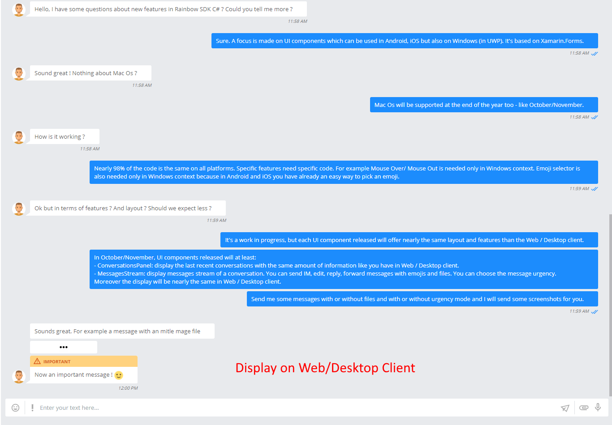
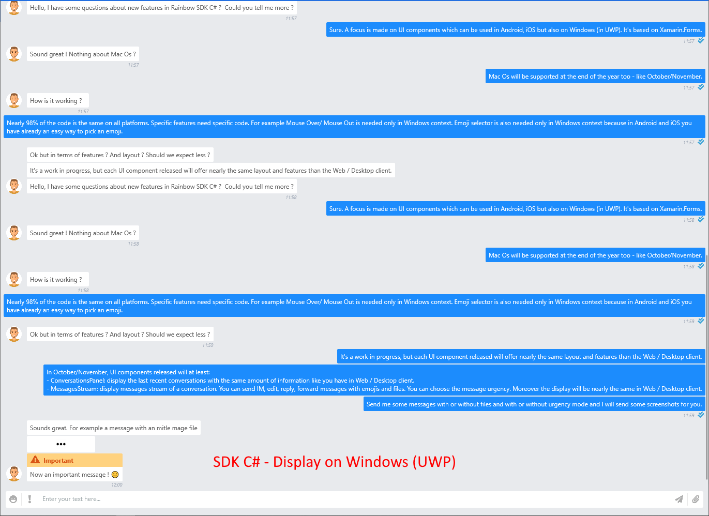
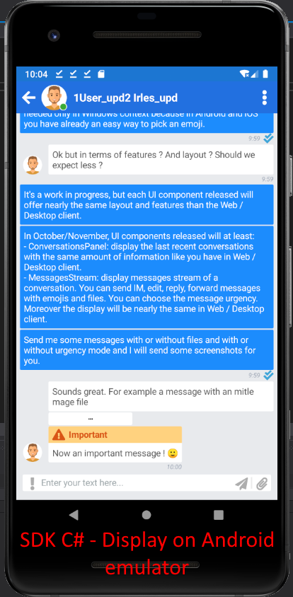

 
# Multiplatform Sample
---

This sample targets  targets **iOS**, **Android** but also **UWP** and **WPF** (experimental for this one)

Nearly 98% of the code is common to all this platform. 

MVVM architecture is used to create this sample as much as possible 

Features available for the moment:

- Conversations list:
    - Avatar of the Bubble ir provided or avatars members 
    - Nb unread messages indicator 
    - Presence level indicator (for peer to peer conversation)
    - Last message receivef or sent
    
- Conversation stream
    - Display list of messages received / sent
    - Display files thumbnail when they are available
    - Allow to send message 
        - with or without Emoji
        - with or without Files 
        - with urgency mode selection
    
Elements implemented but not demonstrable 
- Themes: display is based on a selected theme

# Mandatory information
---

To use this sample you must provide correct information in file **MultiPlatformApplication/ApplicationInfo.cs**
- APP_ID = "TO SPECIFY";
- APP_SECRET_KEY = "TO SPECIFY";
- HOST_NAME = "TO SPECIFY";

# Data storage and environment test 
---

In file **MultiPlatformApplication/ApplicationInfo.cs**, 2 variables can be helpfull if you want to debug/develop this sample:
- **DataStorageUsed**:

Data received from server are stored locally. It's not at all a good way in production. But necessary when using **UseTestEnvironment**

- **UseTestEnvironment**

It uses data previously stored locally to use the application without the needs to have a real connection to the server.

Very useful to add new functionnalities, test/update code with real data without any connection.   
 

# Screenshots
--- 

## Conversation stream

Screenshsots to demonstrate differences between Rainbow Offical Web / Desktop CLient, SDK C# on Windows (UWP) and SDK C# on Android emulator 

