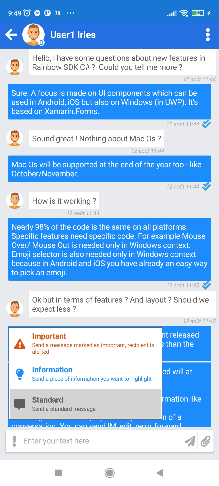

 
# Multiplatform application - Advanced sample
---

This sample targets **iOS**, **Android** and **UWP** (**WPF** also but more experimental for this one due to Microsoft restrictions)

Nearly 98% of the code is common to all this platform. 

MVVM architecture is used to create this sample as much as possible

Use tag like **MutliPlatformApplication_VX.Y** to use a stable version. 

# Features
---

- **Login**:
    - Use SSO (Open Id or SAML) if availeble for the current user
    
- **Avatars**:
    - Automatic download of Avatars (Users and Bubbles)
    - Create automatically a bubble avatar if not specified using members of the bubble (up to 4 avatars members)
    - Take into account update of any avatars
    
- **Recent conversations**:
    - Display list of recent conversations sorted by date
    - The list is updatde using last message received
    - A click or tap on a conversation will display the message streaam of the conversation
     
- **Contacts List**:
    - Display the list of contacts of the current user with their presence level
    - List can sorted by first name, last name or company and filtered by online, offline or any presence level
    
- **Messages stream on a conversation**:
    - **Display**:
        - Event info: Conference started / stopped, Used added / removed in a Bubble
        - Separator to differentiate whether messages are from the same day or not
        - Receipt information: Sent, Received, Read
        - Forwarded, replied, deleted or normal message
        - Support snippet display
        - Urgency display (Emergency, Important, Infomration, Standard)
        - Support animated GIF (stop / start)
        - Image (thumbnail)

    - **Actions possible**:
        - Send message
        - File(s) in attachment
        - Urgency selection (Emergency, Important, Infomration, Standard)
        - Edit message
        - Download / Save file
        - Reply to message
        - Copy message 
        - Delete message
        
- Multi-languages:
    - The UI doesn't permit yet to change it on the fly (using **EN** language by dafault) but it can be changed easily using **Helper.SdkWrapper.SetLanguageId** method. 

# Screenshots
--- 

<table>
  <tr>
    <td><b>
Android
</b></td>
    <td><b>
iOS
</b></td>
    <td><b>
UWP
</b></td>
  </tr>
  <tr>
    <td colspan=3><b>
Message stream
</b></td>
  </tr>
  <tr>
    <td></td>
    <td></td>
    <td></td>
  </tr>
  <tr>
    <td colspan=3><b>
Message stream - Action Menu
</b></td>
  </tr>
  <tr>
    <td></td>
    <td></td>
    <td></td>
  </tr>
  <tr>
    <td colspan=3><b>
Message stream - Replying to message
</b></td>
  </tr>
  <tr>
    <td></td>
    <td></td>
    <td></td>
  </tr>
  <tr>
    <td colspan=3><b>
Message stream - Urgency selectione
</b></td>
  </tr>
  <tr>
    <td></td>
    <td></td>
    <td></td>
  </tr>
  <tr>
    <td colspan=3><b>
Message stream - Typing important message
</b></td>
  </tr>
  <tr>
    <td></td>
    <td></td>
    <td></td>
  </tr>
  <tr>
    <td colspan=3><b>
Recent conversations
</b></td>
  </tr>
  <tr>
    <td></td>
    <td>
    <td></td>
  </tr>
  <tr>
    <td colspan=3><b>
Contacts list - Sorted by first name
</b></td>
  </tr>
  <tr>
    <td></td>
    <td></td>
    <td></td>
  </tr>
  <tr>
    <td colspan=3><b>
Contacts list - Sorted by company
</b></td>
  </tr>
  <tr>
    <td></td>
    <td></td>
    <td></td>
  </tr>
  <tr>
    <td colspan=3><b>
Contacts list - Menu to sort display
</b></td>
  </tr>
  <tr>
    <td></td>
    <td></td>
    <td></td>
  </tr>
</table>

# Tested platform
---    

- **Windows 10:**
    - UWP Platform (Windows 10) (Debug and Relase mode)
 
- **Android:**
    - Android Simulator (Debug and Relase mode):
        - Pixel 2 (Android 9 - API 28)
    - Real device (Debug and Relase mode):
        - Redmi Note 9S (Android 11 - API 30)
- **iPhone:**
    - iPhone Simulator (Debug and Relase mode):
        - Iphone 8 (iOS 15)
    - Real Device (Debug and Relase mode):
        - iPhone 8 (iOS 15)  

# Mandatory information
---

To use this sample you must provide correct information in file **MultiPlatformApplication/ApplicationInfo.cs**
- APP_ID = "TO SPECIFY";
- APP_SECRET_KEY = "TO SPECIFY";
- HOST_NAME = "TO SPECIFY";

# Data storage and environment test 
---

In file **MultiPlatformApplication/ApplicationInfo.cs**, 2 variables can be helpfull if you want to debug/develop this sample:
- **DataStorageUsed**:

Data received from server are stored locally. It's not at all a good way in production (not encrypted). But necessary when using **UseTestEnvironment**

At terms, once encrypted, it will the base to create offline usage if there is no more network connection.

- **UseTestEnvironment**

It uses data previously stored locally to use the application without the needs to have a real connection to the server.

Very useful to add new functionnalities, test/update code with real data without any connection.   
 

