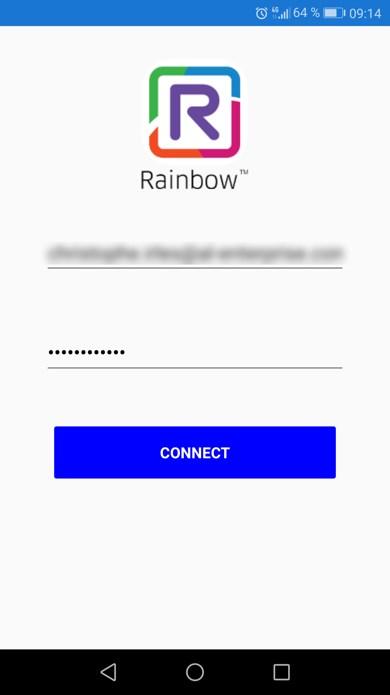
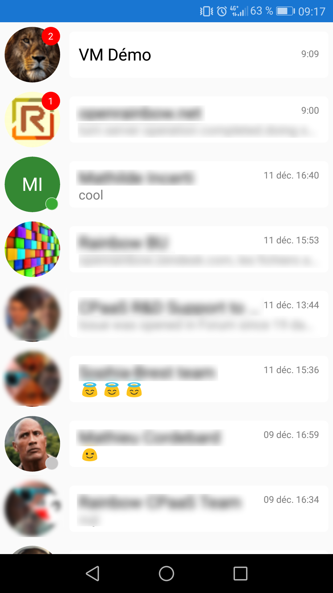
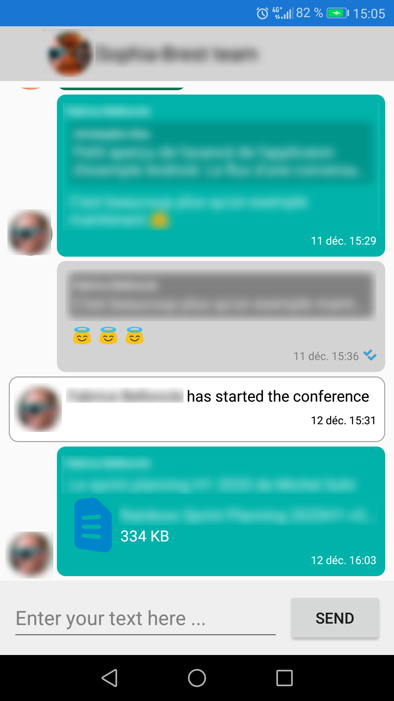

 
# Rainbow CSharp SDK Samples
---

You will find here several samples which illustrate how to use the Rainbow CSharp SDK:

- Small samples to understand how to use the SDK available on **`Windows`** platform (using `.Net Framework`) and **`MacOS`** platform (using `Xamarin`)

- Advanced sample (as **`Mobile application`**) going deeper in SDK use for **`IOS`** and **`Android`** (Both using `Xamarin`)

- Advanced sample (as **`Desktop application`**) going deeper in SDK use for **`Windows`** (using `WPF`)

- S2S (Server to Server) sample (as **`BOT application`**) to understand how to use S2S event mode - full details about S2S versus XMPP event mode [here](https://hub.openrainbow.com/#/documentation/doc/sdk/csharp/guides/035_events_mode) 

## Rainbow API HUB
---

This SDK is using the [Rainbow Hub environment](https://hub.openrainbow.com/)
 
This environment is based on the [Rainbow service](https://www.openrainbow.com/) 

## Rainbow CSharp SDK
---

To have more info about the SDK:
- check [Getting started guide](https://hub.openrainbow.com/#/documentation/doc/sdk/csharp/core/lts/guides/001_getting_started)
- check [API documentation](https://hub.openrainbow.com/#/documentation/doc/sdk/csharp/core/lts/api/Rainbow.Application)

## Small samples
---

They are listed in order of priority if you just started to use the SDK - they are available for **`Windows`** platform (using `.Net Framework`) and **`MacOS`** platform (using `Xamarin`)

| Content | Description | Platform | 
| ------- | ----------- | -------- |
| Contacts  | Manage list of contacts - First sample to understand | [Windows using .NetFwk](https://github.com/Rainbow-CPaaS/Rainbow-CSharp-SDK-Samples/tree/master/Windows_NetFwk/Contacts)  [MacOs using Xamarin](https://github.com/Rainbow-CPaaS/Rainbow-CSharp-SDK-Samples/tree/master/Mac_Xamarin/Contacts)|
| Conversations / Favorites | Manage list of conversations / favorites - Second sample to understand | [Windows using .NetFwk](https://github.com/Rainbow-CPaaS/Rainbow-CSharp-SDK-Samples/tree/master/Windows_NetFwk/Conversations)  [MacOs using Xamarin](https://github.com/Rainbow-CPaaS/Rainbow-CSharp-SDK-Samples/tree/master/Mac_Xamarin/Conversations) |
| Instant Messaging | Send, receive simple IM messages, manage presence | [Windows using .NetFwk](https://github.com/Rainbow-CPaaS/Rainbow-CSharp-SDK-Samples/tree/master/Windows_NetFwk/InstantMessaging)  [MacOs using Xamarin](https://github.com/Rainbow-CPaaS/Rainbow-CSharp-SDK-Samples/tree/master/Mac_Xamarin/InstantMessaging) |
| Conferences | Manage Conferences (PSTN or WebRTC): Start/Join/Stop, Mute/Unmute, Lock/Unlock, Drop particpant) | [Windows using .NetFwk](https://github.com/Rainbow-CPaaS/Rainbow-CSharp-SDK-Samples/tree/master/Windows_NetFwk/Conferences)  [MacOs using Xamarin](https://github.com/Rainbow-CPaaS/Rainbow-CSharp-SDK-Samples/tree/master/Mac_Xamarin/Conferences) |
| Telephony | Manage Conferences (PSTN or WebRTC): Start/Join/Stop, Mute/Unmute, Lock/Unlock, Drop particpant) | [Windows using .NetFwk](https://github.com/Rainbow-CPaaS/Rainbow-CSharp-SDK-Samples/tree/master/Windows_NetFwk/Telephony) |
| Mass Provisioning| Mass provisioning scenario: create company admin, company, teachers, students, classrooms(bubbles) and add members to classrooms. Show how to call asynchronous API in a synchronous way | [Windows using .NetFwk](https://github.com/Rainbow-CPaaS/Rainbow-CSharp-SDK-Samples/tree/master/MassProvisioning) |

## Advanced Mobile Application Sample 
---

It's an advanced example of Instant Messaging for **`IOS`** and **`Android`** (using `Xamarin`) [Advanced sample](https://github.com/Rainbow-CPaaS/Rainbow-CSharp-SDK-Samples/tree/master/Windows_NetFwk/Contacts)

You can see users presence, messages read / unread, receive and send  messages.

Some screenshoots of this sample:

| Login | Conversations List | Conversation Stream |
| ----- | ------------------ | ------------------- |
|  |  |  |

## Advanced Desktop Application Sample 
---

### Instant Messaging example 
---

It's an advanced example of Instant Messaging for **`Windows`** (using `WPF`) [Advanced sample](https://github.com/Rainbow-CPaaS/Rainbow-CSharp-SDK-Samples/tree/master/Windows_WPF/WPF_InstantMessaging)

WORKS IN PROGRESS:
For the moment you can see Favorites and Conversations list, with presence, avatar and nb of unread messages.

### WebRTC Peer To Peer example 
---

It's an advanced example of using Rainbow.CSharp.SDK.Wpf.WebRtcContrl for **`Windows`** (using `WPF`) [Advanced sample](https://github.com/Rainbow-CPaaS/Rainbow-CSharp-SDK-Samples/tree/master/Windows_WPF/WPF_WebRtcControl)

It allows to make WebRtc in Peer To Peer:
- Audio, Video, Sharing
- Choose Audio Input/Ouput, Video Output devices
- Mute/unmute Audio, Video or Sharing

## Server to server (S2S) sample 
---

It's important to read this [guide](https://hub.openrainbow.com/#/documentation/doc/sdk/csharp/core/lts/guides/035_events_mode) first to understand what is a S2S application and the architecture associated.

This [sample](https://github.com/Rainbow-CPaaS/Rainbow-CSharp-SDK-Samples/tree/master/S2S) permits to understand how to use this SDK in Server to server context. It's better first to understand how the use SDK using small examples.

This [sample](https://github.com/Rainbow-CPaaS/Rainbow-CSharp-SDK-Samples/tree/master/S2S) is based on `Instant Messaging` [sample](https://github.com/Rainbow-CPaaS/Rainbow-CSharp-SDK-Samples/tree/master/Windows_NetFwk/InstantMessaging) but using S2S event mode.
