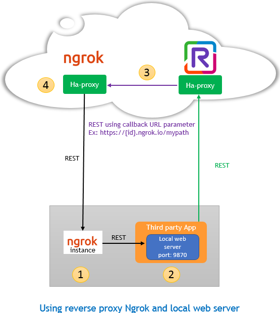
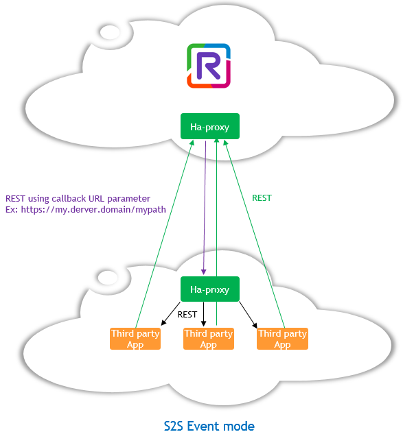

 
# Rainbow-CSharp-SDK-Samples - Server to server (S2S) 
---

This sample demonstrates how to use the CSharp SDK in S2S event mode.

Please read first this [guide](https://hub.openrainbow.com/#/documentation/doc/sdk/csharp/guides/035_events_mode) to understand what the S2S event mode means and the architecture necessary to use it. 

## Based on existing InstantMessaging sample
---

This sample is based of this existing sample: [InstantMessaging](https://github.com/Rainbow-CPaaS/Rainbow-CSharp-SDK-Samples/tree/master/Windows_NetFwk/InstantMessaging).

Only some lines of code have been added to demonstrate how to use the SDK in S2S context.

This sample, for simplification purpose, use [NGROK](https://ngrok.com/) tool like we can see in this diagram:

  

**NOTE:** As explained in the [documentation](https://hub.openrainbow.com/#/documentation/doc/sdk/csharp/guides/035_events_mode), NGROK must be used only in test / development step and not in production environment.  

## Code added/updated
---

1. **Form elements added**

A TextBox and a CheckBox has been added to specify the Callback URL to use and to know if the S2S event mode must be used or not.

With this checkbox, you can see that it's very easy switch easily between S2S and XMPP event mode (you need to use the checkbox before to connection to the server ...) wihtout the need to change your business logic.

2. **Web Server created and started**

When the S2S event mode is used, we create and start a local web server using the CallBack URL specified.  (cf. `CreateWebServer` method). In the sample  the port number of this local web server is hardcoded to 9870.

The package `EmbedIO` is used to create this web server. We need to create a module (cf. `CallbackWebModule` class) to handle incoming HTTP connection.

3. **Use of `ParseCallbackContent` method from `S2SEventPipe` object**  

Your web server will receive data
- with a specific HTTP verb (GET, POST, PUT, etc...)
- with a specific absolute path (for example `mypath` based on the previous screenshoot since the callback URL used is `https://my.derver.domain/mypath`)
- with a specific content (JSON content)
- with a content type

You must check that the `content type` is equal to `application/json`.
                                                                             
For the 3 other data, you don't have to analyse / parse, you just need to provide them to the SDK - then it will parse the information, and, like in XMPP mode, according the result, an event is raised by the SDK. 

To do this you have to use the method `ParseCallbackContent` of the `S2SEventPipe` object. This method returns a boolean to indicate if the parsing has been done correctly or not.

If the parsing is done incorrectly, your web server must return an HTTP 406 Not Acceptable answer.

If the parsing is done correctly, your web server must return an HTTP 200 Ok answer.

All this is implemented in `OnRequestAsync` method from  `CallbackWebModule` class.

## How to use the sample
---

Like all samples / application using the SDK, you need to have an Application ID, an Application Secret Key, a host name and  a valid account (login and password).

Since we are using NKROG here, you also need to start an instance of this tool before to start this sample using this command line:

**ngrok http -host-header="localhost:9870" 9870**

Once started, the tool indicates you the forwarding rule created from the public NKROG internet web site to your local web server running on 9870 (you can use/specify any port number but it must also by changed in the sample)
  
For example, you can have a forward rule like this created by NGROK:

http://0bc3a3bc.ngrok.io -> http://localhost:9870

https://0bc3a3bc.ngrok.io -> http://localhost:9870  

It means that all HTTP or HTTPS requests to the public web server `0bc3a3bc.ngrok.io` will be redirected to your local web server on port 9870.

**NOTE:** Each time your start NGROK another forward rule is created. It's important to notice also that the forward rule is only alive for a few hours (if your are using the free version of this tool). So in your development step, don't forget to check that the forward rule is still alive.

## Next step for production
---

The next step will be to manage/setup your real web server and your environment still using the CSharp SDK nearly in the same way:
- the code to start the local web server must be removed (so the `EmbedIO` package is no more necessary)
- the code to get data from incoming web request must be adapted to your environment (so `CallbackWebModule` class is no more necessary)

Then your configuration will be set like described in this diagram:

  
