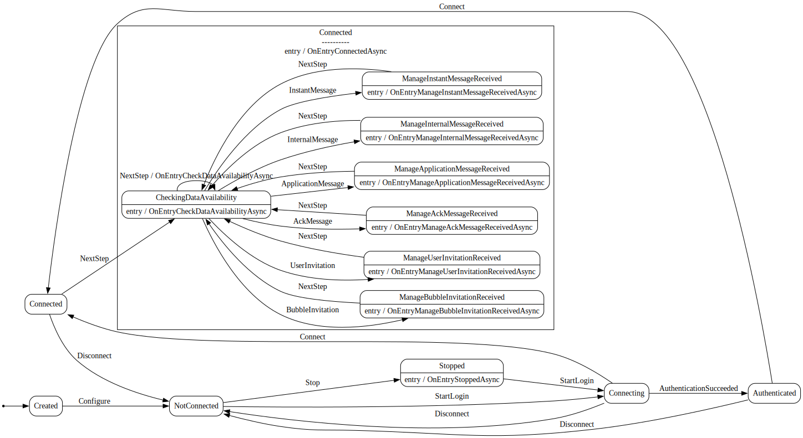

# Rainbow CSharp SDK v3 - Bot Library and Bot examples

You will find here several samples which illustrate how to use the Rainbow CSharp SDK to create Bot.

They are all working in **Linux, MacOs or Windows**. 

They are listed in order of priority / difficulty if you just started to use the SDK and/or create Bot.

All bots are using a [state machine](#StateMachine) to simplify the complexity and inherits from [Bot Base](#BotBase)

## Table of content

- [Prerequisites](#Prerequisites)
    - [Rainbow API HUB](#RainbowAPIHUB)
    - [Rainbow CSharp SDK](#RainbowCSharpSDK)

- [State Machine](#StateMachine)

- [Bot Base](#BotBase): features and how is designed the **BotBase** class (used by inheritance in all examples)
    - [File exeSettings.json](#exeSettings.json)
    - [File credentials.json](#credentials.json)
    - [File botConfiguration.json](#botConfiguration.json)
    - [BotLibrary.BotBase class](#BotLibrary.BotBaseClass)
    - [Implemented features](#Implementedfeatures)
    - [Methods to override](#MethodsToOverride)
    - [Public Properties / Methods available](#PublicPropertiesMethods)
    - [BotConfiguration update](#BotConfigurationUpdate)
    - [How to send a BotConfiguration update](#HowToSendBotConfigurationUpdate)
        - [Using AckMessage](#UsingAckMessage)
        - [Using ApplicationMessage](#UsingApplicationMessage)
        - [Using InstantMessaging](#UsingInstantMessaging)
        - [Using InternalMessage](#UsingInternalMessage)

- [Bot BasicMessages](#BotBasicMessages): Simple bot which auto-answers to all administrators messages.

- [Bot Broadcaster](#BotBroadcaster): Permits to easily broadcast stream(s) in a conference according administrators messages.
    - [Extended BotConfiguration](#ExtendedBotConfiguration)
    - [Features](#BotBroadcasterFeatures)
    - [BotConfiguration update using extended data](#BotConfigurationUpdateExtendedData)

<a name="Prerequisites"></a>
## Prerequisites

<a name="RainbowAPIHUB"></a>
### Rainbow API HUB

This SDK is using the [Rainbow environment](https://developers.openrainbow.com/)
 
This environment is based on the [Rainbow service](https://www.openrainbow.com/) 

<a name="RainbowCSharpSDK"></a>
### Rainbow CSharp SDK

To have more info about the SDK:
- check [Getting started guide](https://developers.openrainbow.com/doc/sdk/csharp/core/lts/guides/001_getting_started)
- check [API documentation](https://developers.openrainbow.com/doc/sdk/csharp/core/lts/api/Rainbow.Application)

<a name="StateMachine"></a>
## State Machine

A third party library ([stateless](https://github.com/dotnet-state-machine/stateless) is used to create the state machine.

Several library exists. This one has been choosed because it's a **lightweight one** (no dependency) and **permits to visualize the state machine** using a dot graph like the one below.

The dot graph can be direclty created from the state machine defined by code using only one line:

```cs 
StateMachine<State, Trigger> _machine; // The state machine
...
String dotGrpah = UmlDotGraph.Format(_machine.GetInfo()); // Create dot graph as String once the state machine has been totally defined   
```

A dot graph is a plain text describing a graph. To visualize it a tool is necessary like these ones:

- [viz-js](http://viz-js.com/): online visualizer

- [GraphvizOnline](https://dreampuf.github.io/GraphvizOnline/): online visualizer

- [graphviz.org](http://www.graphviz.org/)

<a name="BotBase"></a>
## Bot Base

[This bot](./BotLibrary/README.md) is used as base for all other bots (using inheritance)

It's using three JSON configuration files:
- **exeSettings.json**: to define mandatory settings for the application - data structure same for all bots
- **credentials.json**: to define mandatory settings to connect to Rainbow server - data structure same for all bots
- **botConfiguration.json**: to define settings used by the bot - data structure can be enhanced according bot features

It provides a **BotLibrary.BotBase** class which must be inherited according your Bot features. This class provides default features (connection, reconnection, ...) to avoid to implement them each time in you bots.

<a name="exeSettings.json"></a>
### File exeSettings.json
You need to set correctly the file "exeSettings.json" like described in chapter [File exeSettings.json](./../ConfigurationFiles.md#exeSettings.json).

<a name="credentials.json"></a>
### File credentials.json
You need to set correctly the file "credentials.json" like described in chapter [File credentials.json](./../ConfigurationFiles.md#credentials.json)

<a name="botConfiguration.json"></a>
### File botConfiguration.json
This file must be stored in **./config** folder path. This [online tool](https://jsonlint.com/) can be used to ensure that a valid JSON is used.

The data structure of this file can be enhanced according bot features.
Here the minimal/mandatory structure is described.
```javascript
{
  "botConfiguration": {
    "administrators": {
      "rainbowAccounts": [
        {
          "id": "123456454",
          "jid": "9856460@openrainbow.com",
          "login": "my_user1@my_domain.com"
        },
        {
          "id": "455678123546",
          "jid": "5153251487@openrainbow.com",
          "login": "my_user2@my_domain.com"
        }
      ],
      "guestsAccepted": false
    },
    "instantMessageAutoAccept": false,
    "ackMessageAutoAccept": false,
    "applicationMessageAutoAccept": false,
    "bubbleInvitationAutoAccept": true,
    "userInvitationAutoAccept": true
  }
}
```
**Details:**
- **administrators**:
    - **rainbowAccounts**: To define one or several Rainbow accounts which are allowed to send commands to the bot (in this example two are defined). If received by someone else the command is not taken into account.
        - **id**: String (can be null/empty or not set) - Id of the Rainbow Account.
        - **jid**: String (can be null/empty or not set) - Jid of the Rainbow Account.
        - **login**: String (can be null/empty or not set) - Login of the Rainbow Account.
        - NOTE: **id** is used first then **jid** and finally **login**. At least one of them must be set.
    - **guestsAccepted**: Boolean (false by default) - If set to True any guest account can send command to the bot.
- **instantMessageAutoAccept**: Boolean (false by default) - If set to true, the bot will accept any Instant Message (even if not sent by one to the administrators).
- **ackMessageAutoAccept**: Boolean (false by default) - If set to true, the bot will accept any AckMessage (even if not sent by one to the administrators).
- **applicationMessageAutoAccept**: Boolean (false by default) - If set to true, the bot will accept any ApplicationMessage (even if not sent by one to the administrators).
- **bubbleInvitationAutoAccept**: Boolean (true by default) - If set to true, the bot will accept automatically of Bubble invitations.
- **userInvitationAutoAccept**: Boolean (true by default) - If set to true, the bot will accept automatically of User invitations.
- **bot**: To define which bot must take into account this configuration (can be null/empty or not set - so will target any bot)
    - **id**: String (can be null/empty or not set) - Id of the Rainbow Account used by the bot.
    - **jid**: String (can be null/empty or not set) - Jid of the Rainbow Account used by the bot.
    - **login**: String (can be null/empty or not set) - Login of the Rainbow Account used by the bot.

<a name="BotLibrary.BotBaseClass"></a>
### BotLibrary.BotBase class

**BotLibrary.BotBase** class implements this state machine: 


It's dot graph is available [here](./Resources/RainbowBotBase.dotgraph)

<a name="Implementedfeatures"></a>
### Implemented features 

Thanks to the state machine, features available are:
- Authentication,
- Connection, disconnection and auto-reconnection
- Accept Bubble invitations automatically if **bubbleInvitationAutoAccept** is set to true (see [file botConfiguration.json](#botConfiguration.json))
- Accept User invitations automatically if **userInvitationAutoAccept** is set to true (see [file botConfiguration.json](#botConfiguration.json))
- Decline commands sent by users not defined as administrators or guests (see [file botConfiguration.json](#botConfiguration.json))
- Update it's own configuration if a command from a valid administrator or guest is received using a JSON using the same structure than defined in [file botConfiguration.json](#botConfiguration.json). It's called a [BotConfiguration update](#BotConfigurationUpdate).
- Allow access to **AckMessage**, **ApplicationMessage**, **InstantMessage** and **InternalMessage** (using [methods to override](#MethodsToOverride)) sent by administrator or guest (see [file botConfiguration.json](#botConfiguration.json))

All these features are available to any Bot inheriting from **BotLibrary.BotBase** class

<a name="MethodsToOverride"></a>
### Methods to override

**BotLibrary.BotBase** class provides several methods which can be overrided (it's not mandatory) according Bot features.

Methods available which can be overridden are:

```cs
// Called when the Bot is connected to Rainbow server (called also after reconnection)
public virtual async Task ConnectedAsync()

// Called when the Bot has been stopped (after too many auto-reconnection attempts or after a logout)
public virtual async Task StoppedAsync(SdkError sdkerror)

// Called when a Bubble Invitation is received if bubbleInvitationAutoAccept setting is not set to true
public virtual async Task BubbleInvitationReceivedAsync(BubbleInvitation bubbleInvitation)

// Called when a Bubble Invitation is received if userInvitationAutoAccept setting is not set to true
public virtual async Task UserInvitationReceivedAsync(Invitation invitation)

// Called when an AckMessage is received. If it contains a BotConfiguration update, BotConfigurationUpdatedAsync method is called instead
public virtual async Task AckMessageReceivedAsync(AckMessage ackMessage)

// Called when an ApplicationMessage is received. If it contains a BotConfiguration update, BotConfigurationUpdatedAsync method is called instead
public virtual async Task ApplicationMessageReceivedAsync(ApplicationMessage applicationMessage)

// Called when an InstantMessage is received. If it contains a BotConfiguration update, BotConfigurationUpdatedAsync method is called instead
public virtual async Task InstantMessageReceivedAsync(Message message)

// Called when an InternalMessage is received. If it contains a BotConfiguration update, BotConfigurationUpdatedAsync method is called instead
public virtual async Task InternalMessageReceivedAsync(InternalMessage internalMessage)

// Called when a BotConfiguration update has been received
public virtual async Task BotConfigurationUpdatedAsync(BotConfigurationUpdate botConfigurationUpdate)
```

To override a method just do something like this: (here an example using only **StoppedAsync()** and **InstantMessageReceivedAsync()** methods)
```cs
// We use a specific namespace (MyNamespace) which contains your Bot (named MyBot)
namespace MyNamespace
{
    // MyBot inherits from BotLibrary.BotBase
    public class MyBot: BotLibrary.BotBase
    {
        // We override the method StoppedAsync() - notice 'override' keyword and also the use of 'async Task'
        public override async Task StoppedAsync(SdkError sdkerror)
        {
            // Add here your own logic when your bot is stopped

            // If don't use any async method here you can use this code to avoid warning
            // await Task.CompletedTask;
        }

        // We override the method InstantMessageReceivedAsync() - notice 'override' keyword and alsot the use of 'async Task'
        public override async Task InstantMessageReceivedAsync(Message message)
        {
            // Add here your own logic when an IM is received

            // If don't use any async method here you can use this code to avoid warning
            // await Task.CompletedTask;
        }
    }
}
```

For concrete examples, check code of [Bot BasicMessages](#BotBasicMessages) and [Bot Broadcaster](#BotBroadcaster) to see how they override methods to provide their own features.

<a name="PublicPropertiesMethods"></a>
### Public Properties / Methods available

There is also several public properties / methods available in **BotLibrary.BotBase** class.
```cs
/// To provide access to the Rainbow.Application object used by the bot. Permit to use all SDK C# features from it
public Rainbow.Application Application;

/// To get the name of the Bot (it's the prefix defined in file credentials.json file)
public String BotName;

/// To configure the bot - must be called before to use Login()
public async Task<Boolean> Configure(JSONNode jsonNodeCredentials, JSONNode jsonNodeBotConfiguration);

/// Once configured, to start login process
public Boolean Login();

/// To start logout process - StoppedAsync() will be called once done
public void Logout();

/// To add an 'InternalMessage' to the queue. It will be dequeued using InternalMessageReceivedAsync(InternalMessage)'
/// It permits by code to send a BotConfiguration Update or any other data
public void AddInternalMessage(InternalMessage internalMessage);

/// To know if Contact specified is an administrator of this bot
public Boolean IsAdministrator(Contact? contact);

/// To know if Jid specified is administrator of this bot. if this jid is not in the cache, ask the server more info
public async Task<Boolean> IsAdministrator(String? jid);

/// To know if the bot is stopped and why
public (Boolean isStopped, SdkError? sdkError) IsStopped();

/// Get Dot Graph of this Bot
public String ToDotGraph();

/// Get the current state of the Bot (i.e. state of the state machine)
public State GetState();

/// Get the current state of the Bot (i.e. state of the state machine) and the trigger used to reach it
public (State, Trigger) GetStateAndTrigger();

/// Determine if the Bot is in the supplied state
public Boolean IsInState(State state);

/// To check / get the bot status
public (BotLibrary.State state, Boolean canContinue, String message) CheckBotStatus();
```

<a name="BotConfigurationUpdate"></a>
### BotConfiguration update

The term **BotConfiguration update** means that the configuration of the Bot has been updated (by **AckMessage**, **ApplicationMessage**, **InstantMessage** or **InternalMessage**) or at startup (using **Configure()** method). 

This update is based on a JSON structure defined in [file botConfiguration.json](#botConfiguration.json).

**The update is done only** if it has been asked by one of the administrator. (even if **instantMessageAutoAccept**, **ackMessageAutoAccept** or **applicationMessageAutoAccept** are set to true)  

The method **BotConfigurationUpdatedAsync()** is called with **BotConfigurationUpdate** object as parameter.

This object is defined like this:
```cs 
    public class BotConfigurationUpdate
    {
        /// Unique identifier
        public String Id { get; set; }

        /// JSONNode describing the bot configuration
        public JSONNode JSONNodeBotConfiguration { get; set; }

        /// Describe the update context. 
        /// Can be "internalMessage", "ackMessage", "instantMessage", "applicationMessage" or "configFile"
        /// "configFile" is used when the bot is finally connected and permits to have the configuration set as file at startup. There is no ContextData is this case.
        public String Context {  get; set; }

        /// Provide the context data as object - to know it's type use Context property
        /// Can be an AckMessage object, an ApplicationMessage object, a Message object (in InstantMessage context) or InternalMessage object or null
        public Object? ContextData { get; set; }
    }
}
```

So using **Context** and **ContextData** properties, it's possible to know in which context the update is performed.

**JSONNodeBotConfiguration** property as JSONNode object contains all data provided in the update.

If the data provided contains only the JSON structure defined in [file botConfiguration.json](#botConfiguration.json), the **BotLibrary.BotBase** class will update the configuration by itself. So it's possible to update administrators list, bubble/user invitations and any settings defined in the default structure.
It's not necessary to provide all data structure. Only data specified will be updated.

If you provide more data that, you have to manage them using your own implementation. [Bot Broadcaster](#BotBroadcaster) is using this principle to offer new features (media stream selection, which conference must be joined). Check this bot for mode details

<a name="HowToSendBotConfigurationUpdate"></a>
### How to send a BotConfiguration update

<a name="UsingAckMessage"></a>
#### Using AckMessage

**AckMessage** can be sent by code only.

Code example using SDK C#:
```cs
String json;        // a JSON with the same structure as defined in file botConfiguration.json
Peer peerContact;   // valid Peer as Contact
String resource;    // valid resource for this Peer

Rainbow.Application rbApplication; // A valid Rainbow.Application object (with an account already connected)

var instantMessaging = rbApplication.GetInstantMessaging();
await instantMessaging.SendAckMessageAsync(MessageType.Set, peerContact, resource, "botConfiguration", HttpRequestDescriptor.MIME_TYPE_JSON, json);
```

<a name="UsingApplicationMessage"></a>
#### Using ApplicationMessage

**ApplicationMessage** can be sent by code only.

Code example using SDK C#:
```cs
String json;// a JSON with the same structure as defined in file botConfiguration.json
Peer peer;  // valid Peer as Contact or as Bubble

Rainbow.Application rbApplication; // A valid Rainbow.Application object (with an account already connected)

System.Xml.XmlElement botConfiguration = new XmlDocument().CreateElement("botConfiguration");
botConfiguration.InnerText = Rainbow.Util.StringWithCDATA(json);

var instantMessaging = rbApplication.GetInstantMessaging();
await instantMessaging.SendApplicationMessageAsync(peer, [botConfiguration]);
```

<a name="UsingInstantMessaging"></a>
#### Using InstantMessaging

**InstantMessaging** can be sent by code but you can also use any Rainbow CPaaS application.

If want to use a Rainbow CPaaS application, you just have to send an IM (in P2P to the bot or in a bubble where the bot is a member) with a file with ".json" as extension and with the structure defined in [File botConfiguration.json](#botConfiguration.json)

Code example using SDK C# and a file:
```cs
String filePath;    // a path to a file with ".json" as extension and with JSON using the same structure as defined in file botConfiguration.json
Peer peer;          // valid Peer as Contact or as Bubble

Rainbow.Application rbApplication; // A valid Rainbow.Application object (with an account already connected)

var instantMessaging = rbApplication.GetInstantMessaging();
await instantMessaging.SendMessageWithFileAsync(peer, null, filePath);
```

Code example using SDK C# and a String:
```cs
String json;// a JSON with the same structure as defined in file botConfiguration.json
Peer peer;  // valid Peer as Contact or as Bubble

Rainbow.Application rbApplication; // A valid Rainbow.Application object (with an account already connected)

var instantMessaging = rbApplication.GetInstantMessaging();
MemoryStream memoryStream = new(Encoding.UTF8.GetBytes(json));
await instantMessaging.SendMessageWithStreamAsync(peer, null, memoryStream, "botConfiguration.json");
```


<a name="UsingInternalMessage"></a>
#### Using InternalMessage
**InternalMessage** can be sent by code only.

Code example using SDK C#:
```cs
String json;        // a JSON with the same structure as defined in file botConfiguration.json
Peer peer;          // valid Peer as Contact or as Bubble

MyBot mybot;        // A valid mybot object which inherits from BotLibrary.BotBase class and which is connected

InternalMessage internalMessage = new()
    {
        Type = "botConfiguration",
        Data = json
    };
await mybot.AddInternalMessage(internalMessage);
```

<a name="BotBasicMessages"></a>
## Bot BasicMessages

This bot demonstrates how to inherit from [BotLibrary.BotBase class](#BotLibrary.BotBaseClass) and overrides three methods.

It permits to create a bot in ~50 lines which implements all features of [Bot Base](#Implementedfeatures) and also to answer to all **AckMessage**, **ApplicationMessage** and **InstantMessage**.

The full code is:
```cs
using Rainbow;
using System;
using System.Collections.Generic;
using System.Threading.Tasks;
using System.Xml;

namespace BotBasic
{
    public class BotBasicMessages: BotLibrary.BotBase
    {
#region Messages - AckMessage, ApplicationMessage, InstantMessage, InternalMessage
        public override async Task AckMessageReceivedAsync(Rainbow.Model.AckMessage ackMessage)
        {
            // Here we answer to all AckMessage using a default Result message
            await Application.GetInstantMessaging().AnswerToAckMessageAsync(ackMessage, Rainbow.Enums.MessageType.Result);
        }

        public override async Task ApplicationMessageReceivedAsync(Rainbow.Model.ApplicationMessage applicationMessage)
        {
            // Here we answer to all ApplicationMessage using a default message

            String senderDisplayName = await GetSenderDisplayName(applicationMessage.FromJid);

            // Create and send an ApplicationMessage as answer
            List<XmlElement> xmlElements = [];
            var el1 = new XmlDocument().CreateElement("elm1");
            el1.InnerText = Rainbow.Util.StringWithCDATA($"Hi, It's an auto-answer from 'BotBasic' SDK C# example. ApplicationMessage has been sent by [{senderDisplayName}].");
            xmlElements.Add(el1);
            await Application.GetInstantMessaging().AnswerToApplicationMessageAsync(applicationMessage, xmlElements);
        }

        public override async Task InstantMessageReceivedAsync(Rainbow.Model.Message message)
        {
            // Here we answer to InstantMessage using a default message

            String senderDisplayName = await GetSenderDisplayName(message.FromContact?.Peer?.Jid);

            // Create and send an answer
            String answer = $"Hi, It's an auto-answer from 'BotBasic' SDK C# example. InstantMessage received has been sent by {senderDisplayName}.";
            await Application.GetInstantMessaging().AnswerToMessageAsync(message, answer);
        }
    }
#endregion Messages - AckMessage, ApplicationMessage, InstantMessage, InternalMessage

        private async Task<String> GetSenderDisplayName(String? jid)
        {
            // Get the sender as Contact
            var contact = await Application.GetContacts().GetContactByJidInCacheFirstAsync(jid);
            if (String.IsNullOrEmpty(contact?.Peer?.DisplayName))
                return "an unknown contact";
            else
                return $"[{contact.Peer.DisplayName}]";
        }
}
```

<a name="BotBroadcaster"></a>
## Bot Broadcaster

Thanks to inheritance, this bot provides all features of [Bot Base](#Implementedfeatures).

It permits also to broadcast medias in a specific conference so it's necessary to specified **useAudioVideo** as true and a valid value for **ffmpegLibFolderPath** as detailed in [file exeSettings.json](#exeSettings.json).

<a name="ExtendedBotConfiguration"></a>
### Extended BotConfiguration
To specify which stream/media is broadcasted and in which conference, the structure of [file botConfiguration.json](#botConfiguration.json) as been extended.
```javascript
{
  "botConfiguration": {
    "administrators": {
      "rainbowAccounts": [
        {
          "id": "123456454",
          "jid": "9856460@openrainbow.com",
          "login": "my_user1@my_domain.com"
        }
      ],
      "guestsAccepted": false
    },
    "bubbleInvitationAutoAccept": true,
    "userInvitationAutoAccept": true,

    "streams": [
      {
        "id": "id1",
        "media": "audio",
        "uri": "c:\\media\\myAudioFile.mp4",
        "connected": false
      },
      {
        "id": "id2",
        "media": "video",
        "uri": "c:\\media\\myVideoFile.mp4",
        "connected": false
      },
      {
        "id": "id3",
        "media": "video",
        "uri": "rtsp://rtsp.stream/movie",
        "uriSettings": {
          "rtsp_transport": "tcp",
          "max_delay": "0"
        },
        "forceLiveStream": false,
        "connected": false
      },
      {
        "id" : "screen1",
        "media" : "video",
        "uri" : "Composite GDI Display",
        "uriType" : "screen"
      },
      {
        "id" : "webcam1",
        "media" : "video",
        "uri" : "HD Pro Webcam C920",
        "uriType" : "webcam"
      },
      {
        "id" : "microphone1",
        "media" : "audio",
        "uri" : "Microphone (HD Pro Webcam C920)",
        "uriType" : "microphone"
      }
      ,
      {
        "id" : "composition1",
        "media" : "composition",
        "videoComposition" : [ "id2", "webcam1"],
        "videoFilter" : "[1]setpts=PTS-STARTPTS,scale=640:-1[scaled0];[0]setpts=PTS-STARTPTS,scale=250:-1[scaled1];[scaled0][scaled1]overlay=main_w-overlay_w-10:main_h-overlay_h-10"
      }
    ],

    "conference": {
      "id": "632469c100e14c9bf133e889",
      "jid": "632469c100e14c9bf133e889",
      "name": "CCTV Bubble",
      "audioStreamId": "id1",
      "videoStreamId": "id2",
      "sharingStreamId": "id2"
    }
  }
}
```
**Details:**
- **administrators** object, **bubbleInvitationAutoAccept** and **userInvitationAutoAccept**: see [file botConfiguration.json](#botConfiguration.json)
- **streams**: to define one of several streams and how to connect / use them. Using same structure as described in chapter [File streams.json](./../ConfigurationFiles.md#streams.json)
- **conference**: 
    - To define the conference to use. If null or not provided, the bot will not join a conference.
    - if a conference is defined but it's not yet active, the bot will wait and join it when it's started.
    - if a conference is defined but cannot be found by the bot, it will not join the conference.
    - **id**: String (cannot be null/empty) - Id of the bubble/conference
    - **jid**: String (cannot be null/empty) - Jid of the bubble/conference
    - **name**: String (cannot be null/empty) - Full name of the bubble/conference
    - NOTE: At east one of **id**, **jid** or **name** must be defined.
    - **audioStreamId**: String (cannot be null/empty) - Id of the stream (defined in **streams**) to use as Audio stream
    - **videoStreamId**: String (cannot be null/empty) - Id of the stream (defined in **streams**) to use as Video stream
    - **sharingStreamId**: String (cannot be null/empty) - Id of the stream (defined in **streams**) to use as Sharing stream
    - NOTE: if **audioStreamId**, **videoStreamId** are **sharingStreamId** are not defined or all badly set, the bot will not join the conference since there is no valid stream.

<a name="BotBroadcasterFeatures"></a>
### Features
    
Using this extended data structure and sending a [BotConfiguration update](#HowToSendBotConfigurationUpdate), it's now possible:
- to add / remove a Bot in a conference
- to add / remove streams used by the Bot in the conferenc: Audio, Video, Sharing, Audio+Video, Audio+Sharing, Video+Sharing, Audio+Video+Sharing 
- to create a video composition for one or several video streams

<a name="BotConfigurationUpdateExtendedData"></a>
### BotConfiguration update using extended data

As explained in the chapter [BotConfiguration update](#BotConfigurationUpdate), the method **BotConfigurationUpdatedAsync()** is called with **BotConfigurationUpdate** object as parameter.

So the Bot Broadcaster overrides this method and implements it's own logic:
```cs
public override async Task BotConfigurationUpdatedAsync(BotConfigurationUpdate botConfigurationUpdate)
{
    // Ensure to deal with an object not null
    if (botConfigurationUpdate is null)
        return;

    // BotConfigurationExtended object has been created to store data structure specific for this bot
    // We try to parse JSON Node to fill this data structure and if it's correct we update the broadcast configuration
    if (BotConfigurationExtended.FromJsonNode(botConfigurationUpdate.JSONNodeBotConfiguration, out BotConfigurationExtended botConfigurationExtended))
    {
        lock (_lockBotConfiguration)
            _nextBotConfigurationUpdate = botConfigurationUpdate;

        UpdateBroadcastConfiguration();
    }

    await Task.CompletedTask;
}
```

**Details**:
- **botConfigurationUpdate.JSONNodeBotConfiguration** contains all the data sent as [BotConfiguration update](#BotConfigurationUpdate) using [Extended BotConfiguration](#ExtendedBotConfiguration).
- **BotConfigurationExtended** object using **FromJsonNode()** method is used to validate the data.
- If it's correct the new configuration is stored and the broadcast/conference settings is updated in consequence.

To have more details: check [Bot Broadcaster code](./BotBroadcaster), [README](./BotBroadcaster/README.md) and [CHANGELOG](./BotBroadcaster/CHANGELOG.md)