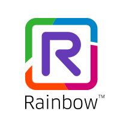

 
# Rainbow CSharp SDK examples - v3.x - Rainbow.Example.CommonWebHook

This project is used as common library to all examples for SDK V3.X using:
- Server To Server (S2S) features
- WebHook features

It permits to centralize:
- same project / packages:
    - project reference to **Rainbow.Example.Common** (which also centralizes dependencies and objects)
    - package reference to **EmbedIO**
- same objects:
	- CallbackS2SModule: to manage easily S2S callback and create / start locally a web server using **EmbedIO**
	- CallbackWebHookModule: to manage easily WebHook/Subscriptions callback and create / start locally a web server using **EmbedIO**
	- SwanLogger: facilitator to log entries from the local web server