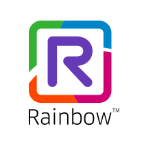

# Rainbow CSharp SDK v3 - Conversations and IM

This console application permits to understand how to use the package [Rainbow.CSharp.SDK.Desktop](https://www.nuget.org/packages/Rainbow.CSharp.SDK.WebRTC.Desktop).

Documentation is available [here](https://developers.openrainbow.com/doc/sdk/csharp/webrtc.desktop/lts/guides/001_getting_started)

## Prerequisites

### Rainbow API HUB

This SDK is using the [Rainbow environment](https://developers.openrainbow.com/)
 
This environment is based on the [Rainbow service](https://www.openrainbow.com/) 

### Rainbow CSharp SDK

To have more info about the SDK:
- check [Getting started guide](https://developers.openrainbow.com/doc/sdk/csharp/core/lts/guides/001_getting_started)
- check [API documentation](https://developers.openrainbow.com/doc/sdk/csharp/core/lts/api/Rainbow.Application)

## Features
- Conversations: list, delete, open
- Instant Messaging: send / receive messages, get older messages, manage receipts

## File exeSettings.json

You need to set correctly the file "exeSettings.json" like described in chapter [File exeSettings.json](./../../ConfigurationFiles.md#exeSettings.json) - no need here to use external dependencies.

## File credentials.json

You need to set correctly the file "credentials.json" like described in chapter [File credentials.json](./../../ConfigurationFiles.md#credentials.json).
