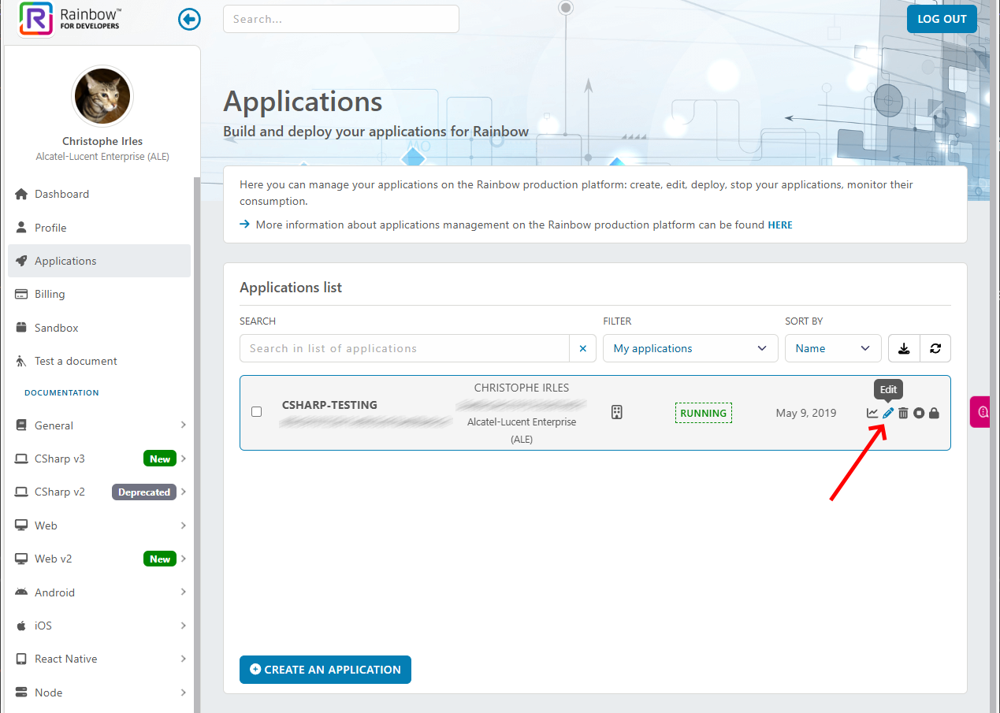

# Rainbow CSharp SDK v3 - WPF - OAuth authentication

This WPF application permits to understand how to use the package [Rainbow.CSharp.SDK](https://www.nuget.org/packages/Rainbow.CSharp.SDK).

Documentation is available [here](https://developers.openrainbow.com/doc/sdk/csharp/core/lts/guides/001_getting_started)

## Prerequisites

### Rainbow API HUB

This SDK is using the [Rainbow environment](https://developers.openrainbow.com/)
 
This environment is based on the [Rainbow service](https://www.openrainbow.com/) 

### Rainbow CSharp SDK

To have more info about the SDK:
- check [Getting started guide](https://developers.openrainbow.com/doc/sdk/csharp/core/lts/guides/001_getting_started)
- check [API documentation](https://developers.openrainbow.com/doc/sdk/csharp/core/lts/api/Rainbow.Application)

## Features

This sample show how to use **OAuth** using SDK C# in **WPF**.

You must firsts ensure that your **OAuth configuration** has been set correctly.

Then you have to configure two files: **credentials.json** and **exeSettings.json**

## OAuth Configuration

You need now to configure an **OAuth Configuration** for your Rainbow Application using the Rainbow Hub Web site: https://developers.openrainbow.com/applications

Use the "Edit" button for your application.

Now go to the section **OAuth 2.0 information** and specify one or several redirect Uri's.

In the previous screenshot, the configuration goal was to define globally a redirection to 127.0.0.1 using several ports: 80, 8080, 1234, 9876, 4567

These ports must then be specified in **credentials.json** configuration file - see next chapter for full details.

## File credentials.json

You need to set correctly the file "credentials.json" like described in chapter [File credentials.json](./../../ConfigurationFiles.md#credentials.json).

## File exeSettings.json

You need to set correctly the file "exeSettings.json" like described in chapter [File exeSettings.json](./../../ConfigurationFiles.md#exeSettings.json) - no need here to use external dependencies.

