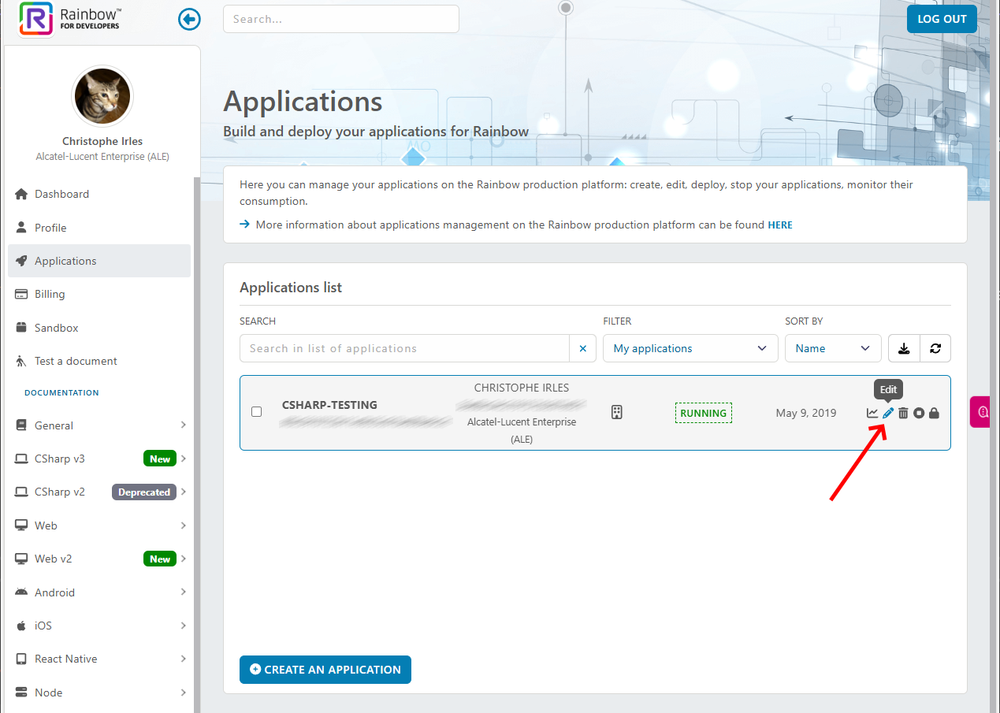
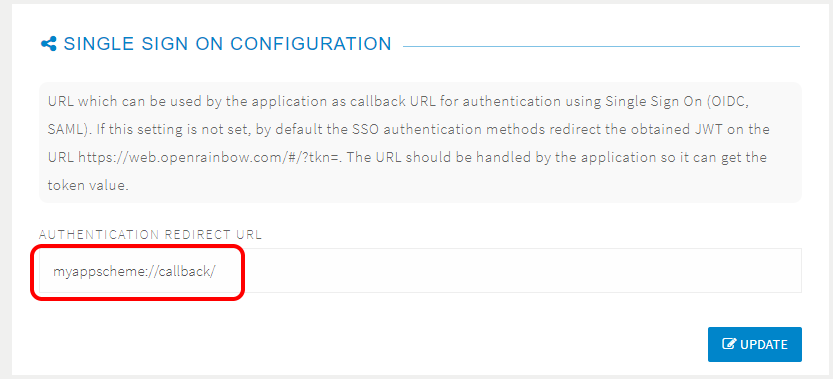
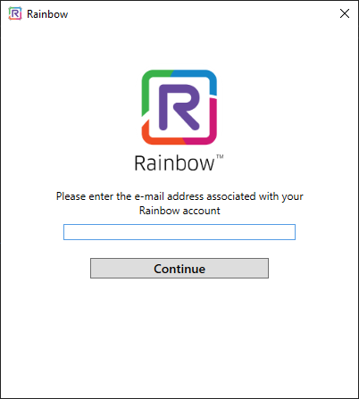

 
# SSO Sample - WPF
---

This sample show how to use **SSO** using SDK C# in **WPF**.

You must firsts ensure that your **SSO configuration** has been set correctly.

Then you need to define an **Authentication Redirection URL** for your Rainbow Application.

Now you are ready to test this SSO sample just after defining **Rainbow Application Settings**.

## SSO Configuration
---

Before to use this sample, you must ensure to have a correct SSO configuration. 

A full documentation to set this configuration can be found here: https://support.openrainbow.com/hc/en-us/articles/360019304499-How-to-configure-SSO-in-Rainbow-admin-view-

Then to check if the configuration is correct, you can use the standard web client and try to connect to Rainbow with any user with a SSO configuration set.

## Define an Authentication Redirection URL
---

You need now to specify an **Authentication Redirection URL** for your Rainbow Application using the Rainbow Hub Web site: https://developers.openrainbow.com/applications

Use the "Edit" button for your application.

Now go to the section **SINGLE SIGN ON CONFIGURATION** and specify a valid URI (for example **"myappscheme://callback/"**). 

It will be used in the SSO Sample application. Don't forget to save using the "Update" button.

## Define Rainbow Application Settings
---

Now open this sample and change the content of the file **AppConfiguration.cs**.

You have first to specify setings common for any samples using the SDK C#:
- **APP_ID**: your Rainbow Application Id
- **APP_SECRET_KEY**: your Rainbow Application Secret
- **HOST_NAME**: The host name you use like "openrainbow.com" or "openrainbow.net"

Now you have to set 2 more settings specific for SSO:
- **URI_SCHEME_FOR_SSO**: The URI scheme you have specified in the Authentication Redirection URL (we used here as example **"myappscheme"**)
- **URI_PATH_FOR_SSO**: The URI paht you have specified in the Authentication Redirection URL (we used here as example **"callback"**)

Now execute the samples and test it with users with SSO settings and without SSO settings. The sample will manage both.

   
 
