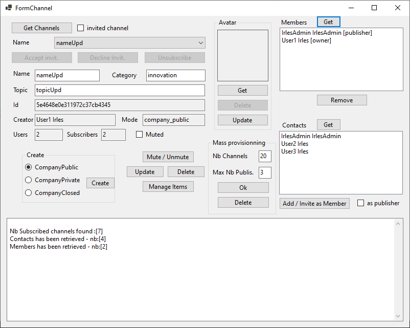

 
# Rainbow-CSharp-SDK - Sample Channels
---

This simple application permits to understand how to manage Channels features.

 - Create / Update / Modiy Channel
 - Set / Get / Update / Remove Channel Avatar
 - Remove / Add / Invite Members
 - Example of Mass provisioning in Channel context
 
 You must ensure to set correct information in file **ApplicationInfo.cs**:
- APP_ID
- APP_SECRET_KEY
- HOST_NAME
- LOGIN_USER
- PASSWORD_USER
 
 
