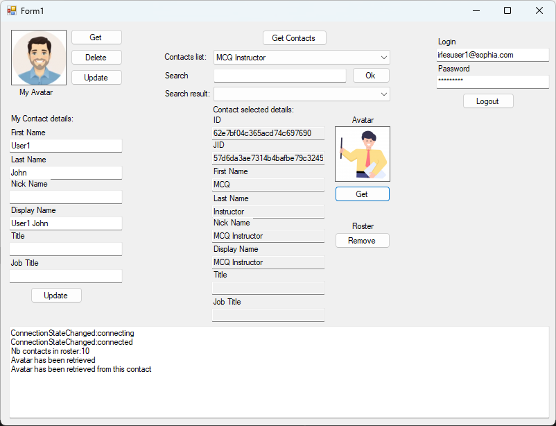

 
# Rainbow-CSharp-SDK - Sample Contacts
---

This simple application permits to understand how :
- To login / to logout to the Rainbow application
- To get your contact details and update it
- To get / update / delete the avatar of your current contact
- To get contacts list of your roster with theirs details and their avatars
- To add / remove contacts from your roster
- To manage events when a contact is added / removed from your roster
- To manage events when a contact modify its avatar or its details
- To manage events when the server connection is updated

You must ensure to set correct information in file **SampleContactForm.cs**:
- APP_ID
- APP_SECRET_KEY
- HOST_NAME
- LOGIN_USER1
- PASSWORD_USER1

 
