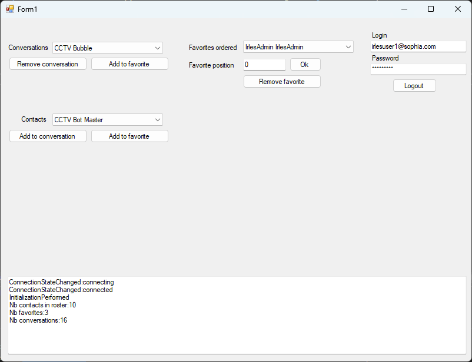

 
# Rainbow-CSharp-SDK - Sample Conversations / Favorites
---

This simple application permits to understand how :
- To login / to logout to the Rainbow application
- To get your conversations
- To add / remove a conversation
- To get favorites
- To add / remove favorites
- To order favorites
- To manage events when a contact is added / removed from your roster
- To manage events when a conversation is created / removed
- To manage events when a favorite is created / removed
- To manage events when the server connection is updated

You must ensure to set correct information in file **SampleConversation.cs**:
- APP_ID
- APP_SECRET_KEY
- HOST_NAME
- LOGIN_USER1
- PASSWORD_USER1

 
